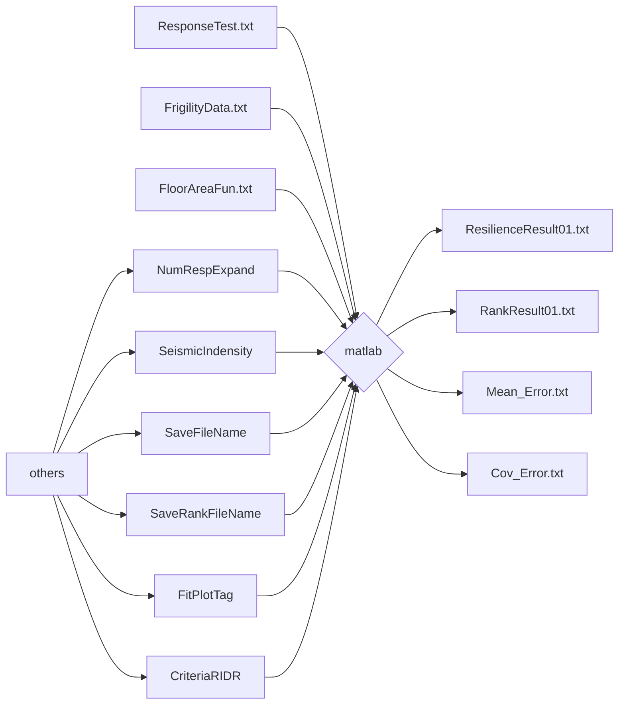

* "ResilienceResult01.txt":输出共NumRespExpand行（NumRespExpand为蒙特卡洛仿真的个数），共四列：每行为一个蒙特卡洛结果，分别为：
  * 修复费用比；
  * 修复时间；
  * 受伤率；
  * 死亡率
* "RankResult01.txt":文件一行，保存5个数，分别为：
  * 84%保证率修复费用；
  * 84%保证率修复时间（天）；
  * 84%保证率受伤率；
  * 84%保证率死亡率；
  * 韧性等级（等级为1 2 3 分别代表一、二、三星，等级为0代表无法按照规范的范围评级）


### 例子
* 以变压器的易损性信息为例，以下为其自定义的易损性信息编写的范例。
```
    {
    "ComponentName": "变压器",
    "ComponentNumber": "NewComponentName",
    "Structural": 0,
    "Description": "750~1500 kVA有锚固或隔振",
    "Unit": "1个",
    "EDPType": "PFA",
    "EDPUnit": "g",
    "DS1": {
    "MedianEDP": "",
    "Beta": "",
    "Description": "",
    "WorkerDay": "",
    "LossFactor": "",
    "RecoveryFactor": ""
    },
    "DS2": {
    "MedianEDP": "",
    "Beta": "",
    "Description": "",
    "WorkerDay": "",
    "LossFactor": "",
    "RecoveryFactor": ""
    },
    "DS3": {
    "MedianEDP": 3.05,
    "Beta": 0.5,
    "Description": "锚固破坏或设备破坏、或同时破坏",
    "WorkerDay": 3.302,
    "LossFactor": 0.66,
    "RecoveryFactor": 1.12
    },
    "DS4": {
    "MedianEDP": "",
    "Beta": "",
    "Description": "",
    "WorkerDay": "",
    "LossFactor": "",
    "RecoveryFactor": ""
    },
    "TimeQReduction": {
    "Factor": [ 1, 1 ],
    "NumStart": [ 1, 10 ],
    "Note": "构件数量3个范围: 1 2~9 10~inf,其中2~9的系数按照数量插值"
    },
    "CostQReduction": {
    "Factor": [ 1, 1 ],
    "NumStart": [ 1, 10 ],
    "Note": "构件数量3个范围: 1 2~9 10~inf,其中2~9的系数按照数量插值"
    },
    "Sequence": 6
    }
```
### 模块01
```
    "ComponentName": "变压器",
    "ComponentNumber": "NewComponentName",
    "Structural": 0,
    "Description": "750~1500 kVA有锚固或隔振",
    "Unit": "1个",


    "EDPType": "PFA",
    "EDPUnit": "g",
```
* "ComponentName":填谢中文名，感觉不要紧
* "ComponentNumber":此处不是填中文名，而是填构件编号名
* "Structural":是否为结构构件，是为1，否为2
* "Description":对于该构件的描述
* "Unit":单位数量该构件的单位
* "EDPType":对应相应信息的种类
* "EDPUnit":对应的相应信息的单位
### 模块02
```
    "DS1": {
    "MedianEDP": "",
    "Beta": "",
    "Description": "",
    "WorkerDay": "",
    "LossFactor": "",
    "RecoveryFactor": ""
    },
```
* "DS1":这边指得是一级损伤状态，一般构件有三级，几级就对应在"DS"后面编写对应数字
* "MedianEDP":响应参数对应的中值
* "Beta":响应参数对应的对数标准差
* "Description":相应的描述，相当于注释
* "WorkerDay":构件损伤后的修复时间
* "LossFactor":构件损伤系数
* "RecoveryFactor":构件恢复系数
* **注：每个构件必须定义且只能定义4个损伤极限状态，依次为轻微、中等、严重、破坏。损伤状态的描述为空，代表构件没有该损伤状态。依照规范现有的数据库，非结构构件的第四状态均为空。**
### 模块03
```
    "TimeQReduction": {
    "Factor": [ 1, 1 ],
    "NumStart": [ 1, 10 ],
    "Note": "构件数量3个范围: 1 2~9 10~inf,其中2~9的系数按照数量插值"
    },
```
* 由于工程量导致的修复工时折减参数（不考虑楼层因素影响）。当构件数量达到1, 10个单位时，修复工时折减系数分别为1, 1。
### 模块04 
```
    "CostQReduction": {
    "Factor": [ 1, 1 ],
    "NumStart": [ 1, 10 ],
    "Note": "构件数量3个范围: 1 2~9 10~inf,其中2~9的系数按照数量插值"
    },
```
* 由于工程量导致的修复费用折减参数（不考虑楼层因素影响）。当构件数量达到1, 10个单位时，修复费用折减系数分别为1, 1。
### 模块05
```
    "Sequence": 6
```
* 构件的维修顺序，共8个维修类，参见规范，Sequence取值范围1~8之间的整数
注意：征求意见稿与正式版规范的维修类顺序不同，V2.0 采用征求意见稿，V2.1 采用正式版规范。