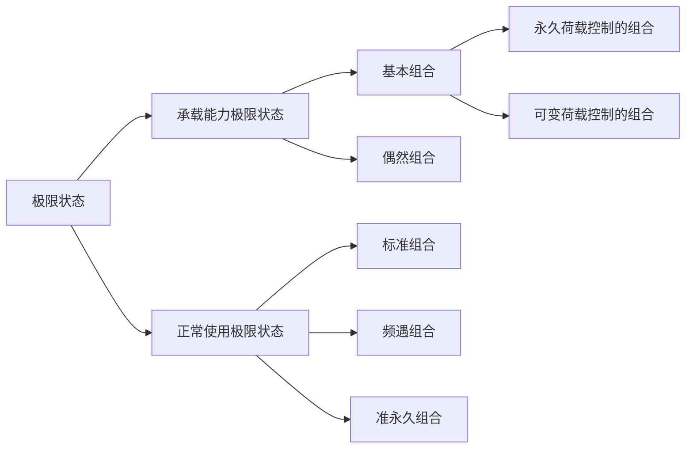
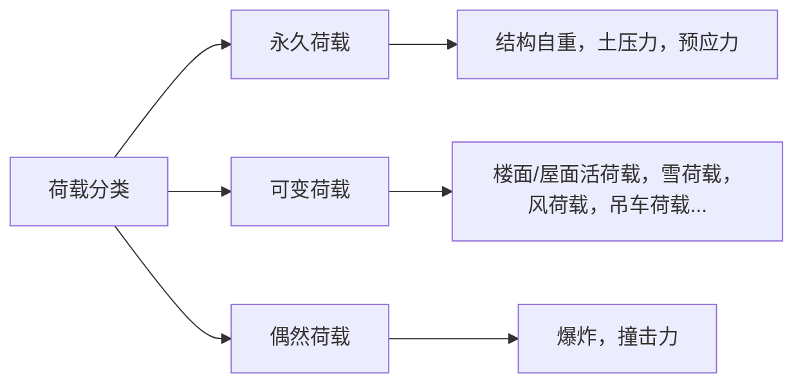

# 荷载和荷载组合

------------------------------

---
* $\gamma_{Gj}$ 第j个永久荷载的分项系数
* $\gamma_{Qj}$ 第j个可变荷载的分项系数
* $\gamma_{Lj}$ 第i个可变荷载的设计使用年限调整系数
* $S_{Gjk}$ 第j个永久荷载标准值对应对结构产生的荷载效应
* $S_{Qjk}$ 第j和可变荷载标准值对应对结构产生的荷载效应
* $\psi_{ci}$ 第i个可变荷载的组合值系数
* $\psi_{fi}$ 第i个可变荷载的频遇系数
* $\psi_{qi}$ 第i个可变荷载的准永久系数