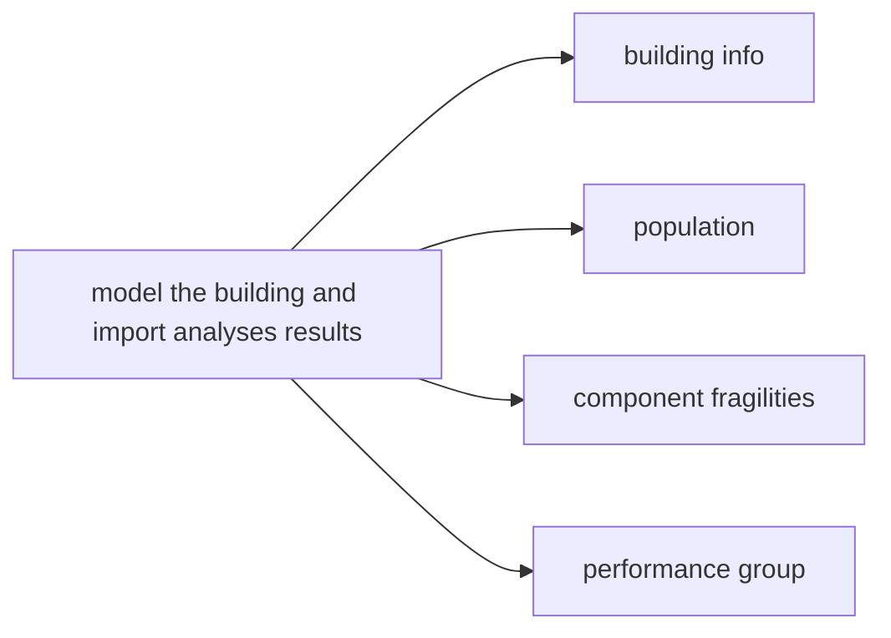
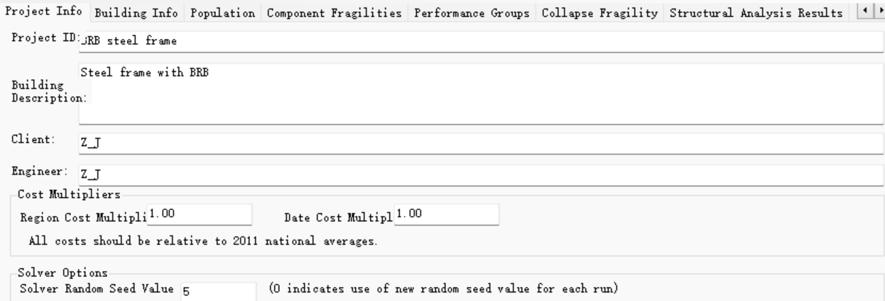

### Project Information Tab

* Project ID, Building Description. Those two options are easy to understand.
* Client 指的是该项目委托方
* Engineer 指的是该项目的分析方
* Cost multipliers: Region cost multipliers and Data cost multipies 指由于该程序中各类构件的修复费用、修复工时性能都是基于2011年美国北加州的市场调研确定的，由于分析时间和地点都有所变化，所以需要打上地域调整系数和时间调整系数来调整。
### Building Information Tab
* Use **"Engineering News Record(ENR). Square foot costbook. Vista, CA: Design and Construction Resources"** 美国造价预算书，2011年的版本。
* **"FEMA P-58" 第二卷**
* core and shell cost: 指基本重置成本，是指基本的建筑结构、、外覆层和非租户提供的结构构件，如电梯、楼梯、厕所和基础的电气服务费用，此外还包括建筑拆除和场地清理的费用。
* 总重置成本为基础重置成本加上租户装修和建筑内容物的费用，比如办公室隔断、天花板、吊灯、采暖通风与空调等。
### Collapse Fragility Tab
* 倒塌易损性函数是一个对数正态分布函数，表示建筑倒塌概率与地震强度之间的关系，通过倒塌地震强度的均值和标准差来定义。
* FEMA-P-58介绍了三种进行建筑倒塌概率评估的方法：**（1）逐步增量的动力时程分析方法；（2）简化的非线性分析方法；（3）基于工程经验判断的倒塌易损性方法。**
* 在评估过程中还要确定：结构可能的倒塌模式，以及各种倒塌模式发生的概率；每种倒塌模式导致的各楼层塌陷面积的比率；在塌陷区域人员出现死亡或者受伤的概率。