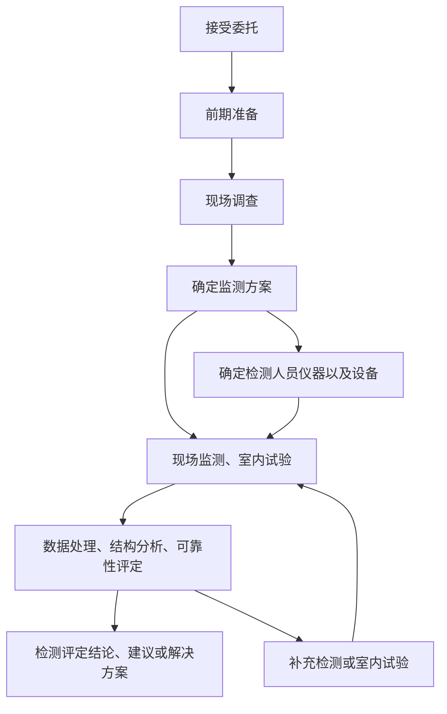

# 结构全寿命维护思考题
## 作业一：
### Q1：施工阶段结构受力有哪些特点？以及结构的时变性体现在哪些方面？
* 施工阶段结构具有时变性、与建成之后的运营期相比施工期相对较短、结构体系或不断
发生改变、结构自重不断增加、基础变形增加、结构内力不断进行重新分布等特点。
### Q2：了解连续梁桥悬臂施工工序，并说明如何进行施工阶段的结构分析？
1. 连续梁桥悬臂施工工序。
   1. 在墩顶托架上浇筑0号块，并实施墩梁临时固结系统。
   2. 在0号块上安装悬臂挂蓝，向两侧依次对称地分段浇筑主梁至合龙前段。
   3. 在临时支架或梁端与边墩间的临时托架上支模浇筑现浇梁段。
   4. 主梁合拢段可浇筑
2. 桥梁的主梁在悬臂施工过程中的受力是为以受负弯矩为主的结构体系，为保证施工过程中的稳定性，对于非墩梁固结的连续梁结构需要将0号块和桥墩临时固结；当悬臂施工状态结束时，结构需要拆除墩梁临时固结，从悬臂结构过渡到连续梁结构，在施工过程中存在结构体系的转换过程；同时，随着悬臂施工结束，将移走用于悬臂施工的挂篮等临时施工荷载。从施工方法可以看出，施工期间与成桥之后的结构受力状态是完全不同的，由于节段梁之间的混凝土龄期差别、结构体系的改变，都将产生明显的由混凝土收缩、徐变引起的结构内力、变形重分布。
### Q3：施工阶段监控的目的和意义？有哪些常规的监控项目和内容？
1. 目的/意义：1. 准确地对施工阶段结构性能的计算是十分困难的，检测和控制是复杂结构施工安全保障的重要技术措施；2. 结构分析可以获得施工过程中结构的理论值，而监测可以获得结构施工过程的真实值，比较分析更能说明问题。
2. 常规的监测项目和内容：
   1. 几何形态监测
   2. 结构应力监测
   3. 地基变形监测
   4. 温度响应监测
   5. 预应力监测
   6. 索力监测

## 作业二：
### Q1：检测评定工作的程序和主要内容？

### Q2：城市桥梁经常性检测，定期检测，特殊检测包含哪些主要内容？
1. 经常检查：主要指对桥面设施、上部结构、下部结构及附属构造的技术状况进行的检查。主要目的一是为小修保养技术提供依据，二是发现明显的部件损坏。
2. 定期检查：它为桥梁养护管理系统搜集结构技术状态的动态数据。通过定期检查可以对结构的损坏做出评估，评定结构构件和整体结构的技术状况，从而确定特别检查的需求与结构维修加固或更换的有限排序。
3. 特殊检查：是查清桥梁病害的原因、破坏程度、承载能力、抗灾能力、确定桥梁技术状况的工作。特殊检查又分为专门检查和应急检查。特殊检查无频率，根据需要，随时均可。
### Q3：如何确定抽样方案？
1. 按检测单元检测的项目，应进行随机抽样，且应满足一定的抽样数量要求。
2. 对结构构件进行现场荷载试验时，同类构件宜选取受力较大、自身现状较差、所处环境恶劣、暴露缺陷较多的构件进行。
3. 建筑、结构图的复核与测绘宜采用全数普查，重点复核的方法。
4. 结构损伤宜采用全数普查，重点抽查的方法。
5. 沉降观测点的选取和布置应反映相对不均匀沉降对房屋整体结构的影响。
6. 整体倾斜观测点的选取应能反映结构不同部位、不同方向上的倾斜。
7. 动测测点的选取和布置应能反映结构关键部位在不同方向上的动力反应。
### Q4：既有结构的测绘主要内容有哪些？
1. 建筑平面测绘图：标明轴线的位置、建筑平面尺寸及细部尺寸、楼地面标高、建筑平面功能和使用情况等建筑立面测绘图：应标明建筑物门窗洞口位置、建筑物竖向相关尺寸、建筑物高度等
2. 建筑剖面图：应标明建筑物门窗洞口位置、建筑物各层竖向间相关关系、楼（屋）面标高、建筑物各层层高和总高度等
3. 细部大样测绘图：对一般建筑应包括楼、地面以及墙面等的细部构造；对具有历史意义的文物、保护性建筑和重要建筑，除应记录其楼、地面细部构造外，还应测绘具有特色的、有历史意义的、受保护部位的细部大样等。
### Q5：论述不同材料的性能检测的主要方法？
1. 混凝土。
   1. 回弹法。根据混凝土材料的硬度测试混凝土的强度。但要进行碳化修正和角度修正，非破损法。
   2. 超声法。根据超声波在混凝土中的传递速度检测混凝土的强度，非破损法。
   3. 超声-回弹综合法。根据回弹法和超声法的检测结构综合评价混凝土的强度，非破损法。
   4. 钻芯取样法。在混凝土中钻取芯样，将其切成标准长度，在万能试验机上受压以测试混凝土的强度，局部破损法。
2. 钢材。
   1. 切取试样法。在钢构件上切取试样做成标准试件，在万能试验机上做拉伸试验直接测钢材的强度和变形指标。
   2. 表面硬度法。对混凝土中钢筋进行检测。**钢筋定位：**用钢筋探测仪探测构件中钢筋的分布与位置，确定被测钢筋；**试件处理：**用便携式切割机小心切割混凝土并撬开钢筋保护层，长约100mm；再用便携式角向磨光机将钢筋表面打磨平整并抛光。尽量避免使被测钢筋受到强烈振动，同时使钢筋的裸露截面小于三分之一，以使混凝土对钢筋仍保持足够的约束力；**里氏硬度测量：**沿钢筋中轴线，用里氏硬度计测量钢筋的里氏硬度值，取五次测试数据的平均值为试件的试验结果。注意使两测点的间距≥3mm；**钢筋强度的换算：**按式fb=0.952HLD+167计算被测钢筋的抗拉强度。
3. 砌体结构
   1. 原位轴压法。检测普通砖砌体的抗压强度（西安建筑科技大学）
   2. 扁顶法。检测砖砌体的强度和弹性模量（湖南大学）
   3. 原位单剪法。检测各种砌体的抗剪强度
   4. 原位单砖双剪法。检测砖砌体的抗剪强度（陕西省建筑科学研究院）
   5. 推出法。检测普通砖墙体的砂浆强度（河南省建筑科学研究院）
   6. 回弹法。

