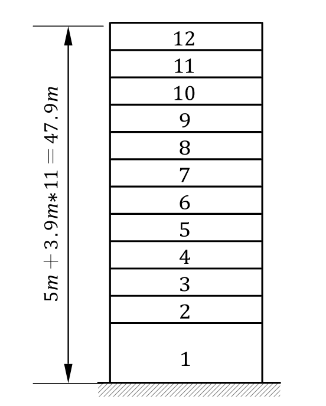

# 高层建筑课后作业
## 第4、5章
### 1. 简述高层建筑中剪力墙的作用以及对整体刚度的影响？
答：    
* 作用有以下几点：1. 承担竖向荷载。2.抵抗地震、风荷载等侧向作用。3.改变结构的变形特点，例如，框架结构为剪切型变形，而框架剪力墙结构为弯剪型变形。4.具有一定的耗能能力。
* 对整体刚度的影响有：1.对结构在剪力墙布置方向提供侧向刚度。2.为结构提供一定的扭转刚度。
### 2. 解释钢骨混凝土框架在高层建筑中的应用以及其和纯钢框架结构的优势对比？
答：    
* 应用：钢骨混凝土指在传统的钢筋混凝土内部包裹型钢。由于包裹的型钢，其抗压强度更强，可以承担更多的重力荷载，更加适合高层建筑建造；同时高层建筑对于侧向力更加敏感，钢骨混凝土框架由于其材料，抗侧刚度强，延性好适合高层建筑的建设。
* 对比：对于纯钢结构来说，其结构构件截面更小，建筑内部可利用空间大；同时结构自重会更轻一点。对于钢骨混凝土框架结构来说，由于构件的截面面积更大，弯曲剪切的刚度更大，承载能力也更强；同时截面面积大保证了构件的稳定性，减少了构件失稳破坏的可能性。
### 3. 在高层建筑设计中，为什么需要严格控制轴压比？请说明轴压比对高层建筑结构稳定性的影响？
答：
* 控制轴压比原因：钢筋混凝土结构的延性主要来自于钢筋的屈服，而当轴压比过大时，柱构件受弯时钢筋不会屈服，此时构件属于小偏压受弯破坏，为脆性破坏。故，为保证构件的延性，需要控制其轴压比。
* 影响：轴压比越大，高层建筑稳定性越差；轴压比越小，高层建筑稳定性越好
### 4. 简述高层建筑在地震作用下的剪压比调整原则及其对梁柱节点设计的影响？
答：
* 原则：当剪压比大于0.15时，梁的强度和刚度即有明显的退化现象，剪压比愈高则退化的愈快，混凝土破坏愈早，这时增加箍筋用量已经不能发挥作用了。因此必须限制截面的剪压比，实质上也是限制截面尺寸不能过小。
* 对节点设计的影响：为防止节点区在受剪时，混凝土的破坏先于箍筋的屈服，需要使得节点区的水平截面不能太小，配箍率不能太高，在设计中常常采用限制节点水平截面上的剪压比来实现这一个要求，当节点区剪压比大于0.35时，增加箍筋的作用已经不明显，这时需要增加节点水平截面尺寸来实现。
### 5. 跨高比对高层建筑梁的设计有何影响？为什么高层建筑中常常采用扁梁设计？
答：
* 影响：梁的跨高比对梁的抗震性能有明显影响。随着跨高比的减小，剪力的影响增大，剪切变形占全部位移的比重亦增大，梁的延性变差，呈现脆性破坏的现象。
* 采用扁梁原因：高层建筑自重大，同时高度高也意味着其受到的侧向力更大，故梁需要更大的截面高度来承担这些力产生的弯矩，而建筑由于使用功能的影响，往往对建筑层高有一定要求，因此为了同时满足高承载力和空间高度的要求，可以设计扁梁。
### 6. 解释双肢剪力墙如何通过连梁协调两侧墙肢的变形，在高层建筑中起到什么作用？
答：
* 当一侧墙肢受到外力作用产生变形时，由于连梁和这侧墙肢连接在一起其也会发生变形产生内力，同时连梁的内力又可以传递给另一侧墙肢，使得另一侧墙肢发生变形，此时连梁相当于另一侧墙肢的外力的来源，使得其和另一侧墙肢共同承担的外力作用，连梁就是通过其变形协调两侧墙肢的变形。
* 作用：在高层建筑中，连梁可以将各剪力墙连接为一个整体，增加结构的整体性，使其协同变形，共同承担侧向力。
### 7. 在高层建筑中，为什么开口剪力墙需要特别考虑剪力传递路径和局部刚度的增强？
答：
* 开口剪力墙使得原本的连续墙体中间被打断，使得开口处的抵抗剪力的面积减小，在开口处产生应力集中现象。
* 开口处由于截面的缺失使得其刚度大大降低，为了防止软弱层的出现，需要对开口处的刚度进行特别的加强。
### 8. 拟在7度区建一栋12层的高层办公楼，采用钢筋混凝土框架结构，底层层高为5m，其余层高为3.9m，东西向总长48m，柱间距8m，南北向总长24m，柱间距6m，各层楼面静载标准值均为5.5$kN/m^2$，活荷载标准值为$kN/m^2$，混凝土材料选用C35（$f_c = 16.7MPa$），试估算柱子的截面尺寸。
答：

计算结构总高，用于确定框架的抗震等级
$$
H = 3.9 \times 11 + 5 = 47.9m
$$

由于上海地区为7度设防地区，同时根据《抗规》相关规定，故该框架为二级框架，轴压比取0.75。同时考虑地震作用，在取柱轴压力设计值时取地震作用组合下的轴压力设计值，在此例中即对重力荷载代表值乘以1.2的分项系数，同时假定柱子截面均为正方形截面，故计算过程如下表。
$$
\frac{N}{f_cA} \leq 0.75   
\\A \geq \frac{N}{0.75f_c}
$$
| 楼层 | 上部楼面/屋面板数 | 楼面/屋面荷载重力荷载代表值/$kN$ | 重力荷载代表值设计值/$kN$ | 单根柱轴压力设计值/$kN$ | 最小截面面积/$mm^2$ | 计算最小截面尺寸/$mm$ |
| :--- | :---------------- | :------------------------------- | :------------------------ | :---------------------- | :------------------ | :-------------------- |
| 1    | 12                | 93312                            | 111974.4                  | 3199.268571             | 273675.6691         | 523.1402002           |
| 2    | 11                | 85536                            | 102643.2                  | 2932.662857             | 250869.3633         | 500.8686088           |
| 3    | 10                | 77760                            | 93312                     | 2666.057143             | 228063.0576         | 477.5594806           |
| 4    | 9                 | 69984                            | 83980.8                   | 2399.451429             | 205256.7518         | 453.0527031           |
| 5    | 8                 | 62208                            | 74649.6                   | 2132.845714             | 182450.446          | 427.1421848           |
| 6    | 7                 | 54432                            | 65318.4                   | 1866.24                 | 159644.1403         | 399.5549278           |
| 7    | 6                 | 46656                            | 55987.2                   | 1599.634286             | 136837.8345         | 369.9159831           |
| 8    | 5                 | 38880                            | 46656                     | 1333.028571             | 114031.5288         | 337.6855472           |
| 9    | 4                 | 31104                            | 37324.8                   | 1066.422857             | 91225.22302         | 302.0351354           |
| 10   | 3                 | 23328                            | 27993.6                   | 799.8171429             | 68418.91727         | 261.5701001           |
| 11   | 2                 | 15552                            | 18662.4                   | 533.2114286             | 45612.61151         | 213.5710924           |
| 12   | 1                 | 7776                             | 9331.2                    | 266.6057143             | 22806.30576         | 151.0175677           |

由于处于一、二、三级抗震等级时，矩形截面柱的边长不宜小于400mm，故实际柱子截面尺寸取值如下：
| 楼层         | 1   | 2   | 3   | 4   | 5   | 6   | 7   | 8   | 9   | 10  | 11  | 12  |
| ------------ | --- | --- | --- | --- | --- | --- | --- | --- | --- | --- | --- | --- |
| 柱边1长/$mm$ | 550 | 550 | 500 | 500 | 500 | 450 | 400 | 400 | 400 | 400 | 400 | 400 |
| 柱边2长/$mm$ | 550 | 550 | 500 | 500 | 500 | 450 | 400 | 400 | 400 | 400 | 400 | 400 |
### 9.  如图所示三层框架结构，混凝土强度为C30，其中柱截面尺寸均为400mm×400mm，梁截面尺寸均为250mm×600mm，所受水平荷载每层均为30kN，要求：（1）用反弯点法求内力图（2）用D值法求内力图（3）用D值法求框架顶侧移

答：
1. 采用反弯点法

| 梁     | 截面宽 | 截面高 | 跨度/mm | 惯性矩Ib | 线刚度   |
| :----- | :----- | :----- | :------ | :------- | :------- |
| AB间梁 | 250    | 600    | 6000    | 4.50E+09 | 2.25E+10 |
| BC间梁 | 250    | 600    | 9000    | 4.50E+09 | 1.50E+10 |

| 柱编号   | 截面宽 | 截面高 | 层高 | 惯性矩Ic | 线刚度   | 抗侧刚度 |
| :------- | :----- | :----- | :--- | :------- | :------- | :------- |
| 底层柱   | 400    | 400    | 5000 | 2.13E+09 | 1.28E+10 | 6.14E+03 |
| 一般层柱 | 400    | 400    | 4500 | 2.13E+09 | 1.42E+10 | 8.43E+03 |

由于各层柱抗侧刚度均相同，因此层间剪力均匀分布。
| 层号 | 水平荷载 | 层间剪力 | $d_a / \sum d$ | $d_b / \sum d$ | $d_c / \sum d$ | $V_a$ | $V_b$ | $V_c$ |
| ---- | -------- | -------- | -------------- | -------------- | -------------- | ----- | ----- | ----- |
| 3    | 30       | 30       | 0.333          | 0.333          | 0.333          | 10    | 10    | 10    |
| 2    | 30       | 60       | 0.333          | 0.333          | 0.333          | 20    | 20    | 20    |
| 1    | 30       | 90       | 0.333          | 0.333          | 0.333          | 30    | 30    | 30    |

2. 采用D值法

| 一般层 | K           | alpha       | 未修正刚度kN/mm | 修正刚度kN/mm |
| :----- | :---------- | :---------- | :-------------- | :------------ |
| 中柱   | 0.444839858 | 0.181950509 | 8427.983539     | 1533.475899   |
| 边柱   | 0.266903915 | 0.117739403 | 8427.983539     | 992.3057542   |

| 底层 | K           | alpha       | 未修正刚度kN/mm | 修正刚度kN/mm |
| :--- | :---------- | :---------- | :-------------- | :------------ |
| 中柱 | 0.610749186 | 0.425452277 | 6144            | 2613.97879    |
| 边柱 | 0.366449511 | 0.366139023 | 6144            | 2249.558156   |

 
 

| 层号 | 水平荷载kN | 层间剪力kN | $D_a / \sum D$ | $D_b / \sum D$ | $D_c / \sum D$ | $V_a~kN$ | $V_b~kN$ | $V_c~kN$ |
| ---- | ---------- | ---------- | -------------- | -------------- | -------------- | -------- | -------- | -------- |
| 3    | 30         | 30         | 0.316          | 0.367          | 0.316          | 9.48     | 11.01    | 9.48     |
| 2    | 30         | 60         | 0.282          | 0.436          | 0.282          | 16.92    | 26.16    | 16.92    |
| 1    | 30         | 90         | 0.282          | 0.436          | 0.282          | 25.38    | 39.24    | 25.38    |

A柱
| 层号 | K           | y0   | y1  | y2     | y3     | y     |
| ---- | ----------- | ---- | --- | ------ | ------ | ----- |
| 3    | 0.266903915 | 0.20 | 0   | 0      | 0      | 0.200 |
| 2    | 0.266903915 | 0.47 | 0   | 0      | -0.025 | 0.445 |
| 1    | 0.366449511 | 0.77 | 0   | -0.025 | 0      | 0.745 |

B柱 
| 层号 | K           | y0   | y1  | y2  | y3  | y     |
| ---- | ----------- | ---- | --- | --- | --- | ----- |
| 3    | 0.444839858 | 0.27 | 0   | 0   | 0   | 0.270 |
| 2    | 0.444839858 | 0.45 | 0   | 0   | 0   | 0.450 |
| 1    | 0.610749186 | 0.73 | 0   | 0   | 0   | 0.730 |

C柱
| 层号 | K           | y0   | y1  | y2     | y3     | y     |
| ---- | ----------- | ---- | --- | ------ | ------ | ----- |
| 3    | 0.266903915 | 0.20 | 0   | 0      | 0      | 0.200 |
| 2    | 0.266903915 | 0.47 | 0   | 0      | -0.025 | 0.445 |
| 1    | 0.366449511 | 0.77 | 0   | -0.025 | 0      | 0.745 |

1. 框顶侧移计算

| 层号 | 层剪力N | 柱a，D值kN/mm | 柱b，D值kN/mm | 柱c，D值kN/mm | 总D值kN/mm  | 层间侧移/mm | 楼层侧移/mm |
| :--- | :------ | :------------ | :------------ | :------------ | :---------- | :---------- | :---------- |
| 3    | 30000   | 992.3057542   | 1533.475899   | 992.3057542   | 3518.087407 | 8.527360616 | 38.23480176 |
| 2    | 60000   | 992.3057542   | 1533.475899   | 992.3057542   | 3518.087407 | 17.05472123 | 29.70744114 |
| 1    | 90000   | 2249.558156   | 2613.97879    | 2249.558156   | 7113.095101 | 12.65271991 | 12.65271991 |

