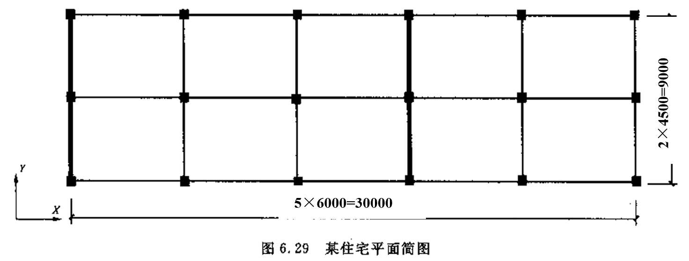

# 高层建筑课后作业
## 第6章
### 1. 框架-剪力墙结构的侧移曲线有什么特点？与刚度特征值的关系如何？
答：
* 框架剪力墙的侧移曲线呈现反s形的弯剪型位移曲线
* 刚度特征值是反映总框架和总剪力墙刚度比值的一个参数，当刚度特征值较小时，说明总剪力墙的等效刚度处于主导地位，结构侧移曲线向弯曲型发展；当刚度特征值较大时，说明总框架的刚度占主导地位，结构侧移曲线向剪切型发展。
### 2. 框架-剪力墙结构中，剪力墙的布置原则有哪些？这些原则对结构性能有何影响？
答：
* 剪力墙的布置应当遵循“均匀、分散、对称、周边”的原则。
* “均匀、分散”指剪力墙布置的数量应当较多，且均匀、分散的布置在结构平面上，使得结构在布置平面内受力均匀。
* “对称”指剪力墙在平面上应当均匀布置，使得剪力墙的受力中心线和刚度中心接近，减小结构的扭转作用。
* “周边”指剪力墙应当布置在建筑平面周边，因为这样可以最大程度的发挥剪力墙的抗扭性能。
### 3. 描述框架-剪力墙结构在水平荷载作用下，框架和剪力墙之间的荷载分配机制。
答：
* 在水平力作用下，框剪结构的剪力分配随楼层高度所处高度变化而变化。在框剪结构的下部楼层中，由于剪力墙位移小，拉住了框架的变形，使得在底部楼层中剪力大部分由剪力墙承担；而在上部结构中，由于剪力墙的位移越来越大，框架的变形反而越来越小，故框架除了要承担自身由于水平力产生的剪力外，还要负担拉回剪力墙变形的附加剪力，故在上部结构中由于水平力产生的楼层剪力很小，而框架中仍然有相当数量的剪力。
### 4. 框剪结构有哪些计算简化方式？不同的计算简化中框架和剪力墙是如何连接的？
答：
* 计算简化假定：
  * 楼板在自身平面内的刚度无限大。这一假定保证楼板将整个计算区段内的框架和剪力墙连成一个整体，在水平荷载作用下，框架和剪力墙之间不产生相对位移。
  * 当结构体系规则，剪力墙布置比较均匀时，结构在水平荷载作用下不计扭转的影响，反之则要考虑扭转的影响。
  * 不考虑剪力墙和框架柱的轴向变形以及基础的转动
* 计算简化方式：刚接体系和铰接体系。
  * 铰接体系中，各剪力墙沿一个方向布置，楼板的作用仅仅是保证各片平面结构具有相同的位移，但楼面外刚度非常小，不起到约束弯矩的作用，因此可以将楼板看作铰接的连杆，总框架和总剪力墙之间通过铰接连杆相连。
  * 刚接体系中，各剪力墙沿着不同方向布置，给楼板提供了平面外的刚度，使得楼板可以约束剪力墙的转动，楼板成为连接总框架和总剪力墙之间的一端刚接一端铰接的连杆。
### 5. 总剪力墙和总框架的内力是如何分配计算的？
答：
* 剪力墙内力分配计算：由框架-剪力墙协同工作原理可以解得侧移曲线，从而求解得到总剪力墙在不同高度处的弯矩和剪力，按照各片墙的等效抗弯刚度进行分配可以得到各片墙的内力。
* 框架梁、柱的内力分配，由于无论是刚结模型还是铰接模型，与总框架相连的部分始终为铰接节点，因此总框架内只有剪力作用，故可按各柱的抗侧移刚度D值把总剪力分配到各柱上，为了简化计算，这里近似地取各层柱的中点作为反弯点位置。计算出柱端弯矩后可以利用力的平衡方程解得梁端弯矩。
### 6. 总框架的D值和Cf值的物理意义各是什么？两者之间有什么关系？
答：
* D值指使框架柱两端产生相对侧移时所需要的剪力；Cf值指使总框架在楼层间产生相对单位剪切变形时所需要的水平剪力
* 关系如下公式：
  $$
  C_f = hD = h\sum D_j
  $$

### 7. 铰接体系和刚接体系在计算步骤上有什么不同？
答：
* 铰接体系：
  * 先将铰接体系中的连杆切开，建立协同工作微分方程。先取总剪力墙为脱离体，按照悬臂构件的方式写出内力与弯曲变形的微分方程；再写出总框架的弯曲变形的微分方程，根据计算假定，总框架和总剪力墙具有相同的侧移曲线，将；两个微分方程写为一个总方程。
  * 根据外力条件的不同可以求解出该微分方程的解，得到侧移曲线的方程，并进一步得到剪力墙的弯矩和剪力，通过图表绘制结果，利用查表方式得到。
* 刚接体系：
  * 根据连梁对剪力墙的约束弯矩，重新写出框架剪力墙微分方程，形式与铰接体系类似，但是这其中由于剪力墙刚接的原因，刚度特征值的计算与铰接体系不同。
  * 在查表时，得到的剪力墙内力包含了连梁的作用，需要求出连梁的约束作用力大小后，再进行扣除。
### 8. 框架-剪力墙结构抗震设计时需要根据框架部分进行哪些调整？
答：
* 框架部分承受的地震倾覆力矩不大于结构总地震倾覆力矩的10%，按剪力墙结构设计，其中框架部分应当按框架-剪力墙结构的框架设计。
* 当框架部分承受的地震倾覆力矩大于结构总地震倾覆力矩的10%但不大于50%时，按框架-剪力墙结构设计
* 当框架承部分承受的地震倾覆力矩大于结构总地震倾覆力矩的50%但不大于80%时，按框架-剪力墙结构设计，其中最大适用高度可比框架结构适当增加，框架部分的抗震等级和轴压比限值宜按照框架结构的规定。
* 当框架部分承受的地震倾覆力矩大于结构总地震倾覆力矩的80%时，应当按框架-剪力墙结构进行设计，但最大适用高度宜按框架结构采用，框架部分的抗震等级和轴压比限值应按框架结构的规定采用。
### 9. 某6层住宅,层高3m。每层自重为3250kN,每层结构布置相同,如图所示。抗震设计烈度为7度,Ⅳ类场地,设计地震分组为第二组，结构基本自振周期为1.12s。柱截面尺寸全部为400mm×400mm,混凝土强度等级为C30。梁截面尺寸全部为250mm*400mm,混凝士强度等级为C20。剪力墙厚度为200mm,混凝土强度等级为C30。计算横向地震作用下(Y向)框架-剪力墙的内力。

* 框架刚度计算

| 柱截面特性计算 |      | E    | 30000    | mPa  |          |
| :------------- | :--- | :--- | :------- | :--- | :------- |
| 层数           | b/mm | h/mm | Ic/mm4   | H/mm | ic/Nmm   |
| 1              | 400  | 400  | 2.13E+09 | 3000 | 2.13E+10 |
| 2              | 400  | 400  | 2.13E+09 | 3000 | 2.13E+10 |
| 3              | 400  | 400  | 2.13E+09 | 3000 | 2.13E+10 |
| 4              | 400  | 400  | 2.13E+09 | 3000 | 2.13E+10 |
| 5              | 400  | 400  | 2.13E+09 | 3000 | 2.13E+10 |
| 6              | 400  | 400  | 2.13E+09 | 3000 | 2.13E+10 |

| 梁截面特性计算 |      | E    | 25500    | mPa  |          |
| :------------- | :--- | :--- | :------- | :--- | :------- |
| 层数           | b/mm | h/mm | Ic/mm4   | H/mm | ib/Nmm   |
| 1              | 250  | 400  | 1.33E+09 | 4500 | 7.56E+09 |
| 2              | 250  | 400  | 1.33E+09 | 4500 | 7.56E+09 |
| 3              | 250  | 400  | 1.33E+09 | 4500 | 7.56E+09 |
| 4              | 250  | 400  | 1.33E+09 | 4500 | 7.56E+09 |
| 5              | 250  | 400  | 1.33E+09 | 4500 | 7.56E+09 |
| 6              | 250  | 400  | 1.33E+09 | 4500 | 7.56E+09 |
  
各层柱D值计算

| 楼层     | 中柱     |          |          |          |          | 边柱     |             |          |          |          |
| :------- | :------- | :------- | :------- | :------- | :------- | :------- | :---------- | :------- | :------- | :------- |
| 总ib/Nmm | ic/Nmm   | K        | alpha    | D        | 总ib/Nmm | ic/Nmm   | K           | alpha    | D        |          |
| 6        | 3.02E+10 | 2.13E+10 | 7.08E-01 | 2.62E-01 | 7.44E+03 | 1.51E+10 | 21333333333 | 3.54E-01 | 1.50E-01 | 4.28E+03 |
| 5        | 3.02E+10 | 2.13E+10 | 7.08E-01 | 2.62E-01 | 7.44E+03 | 1.51E+10 | 21333333333 | 3.54E-01 | 1.50E-01 | 4.28E+03 |
| 4        | 3.02E+10 | 2.13E+10 | 7.08E-01 | 2.62E-01 | 7.44E+03 | 1.51E+10 | 21333333333 | 3.54E-01 | 1.50E-01 | 4.28E+03 |
| 3        | 3.02E+10 | 2.13E+10 | 7.08E-01 | 2.62E-01 | 7.44E+03 | 1.51E+10 | 21333333333 | 3.54E-01 | 1.50E-01 | 4.28E+03 |
| 2        | 3.02E+10 | 2.13E+10 | 7.08E-01 | 2.62E-01 | 7.44E+03 | 1.51E+10 | 21333333333 | 3.54E-01 | 1.50E-01 | 4.28E+03 |
| 1        | 1.51E+10 | 2.13E+10 | 7.08E-01 | 4.46E-01 | 1.27E+04 | 7.56E+09 | 21333333333 | 3.54E-01 | 3.63E-01 | 1.03E+04 |
  
总框架剪切刚度计算，根据下表结果为1.05E+09 Nmm
| 楼层 | 中柱     | 边柱     |          |
| :--- | :------- | :------- | :------- |
| D    | D        | Cf       |          |
| 6    | 7.44E+03 | 4.28E+03 | 9.20E+08 |
| 5    | 7.44E+03 | 4.28E+03 | 9.20E+08 |
| 4    | 7.44E+03 | 4.28E+03 | 9.20E+08 |
| 3    | 7.44E+03 | 4.28E+03 | 9.20E+08 |
| 2    | 7.44E+03 | 4.28E+03 | 9.20E+08 |
| 1    | 1.27E+04 | 1.03E+04 | 1.71E+09 |

* 剪力墙刚度计算
  
| $\mu $   | 1.2  | E    | 30000  |       |           |            |          |
| :------- | :--- | :--- | :----- | :---- | :-------- | :--------- | :------- |
| 墙体代号 | b/mm | h/mm | Aw/mm2 | H/mm  | Iw /mm4   | EIeq       | sumEIeq  |
| 1        | 200  | 4500 | 900000 | 18000 | 6.075E+12 | 1.8225E+17 | 7.29E+17 |
| 2        | 200  | 4500 | 900000 | 18000 | 6.075E+12 | 1.8225E+17 | 7.29E+17 |
| 3        | 200  | 4500 | 900000 | 18000 | 6.075E+12 | 1.8225E+17 | 7.29E+17 |
| 4        | 200  | 4500 | 900000 | 18000 | 6.075E+12 | 1.8225E+17 | 7.29E+17 |
  
  总刚度为2.916E+18N/mm，计算得到刚度特征值为0.3418

* 地震作用计算
  场地为IV类场地，场地自振周期为0.75s，阻尼比为0.05，且结构基本自振周期为1.12s，采用7度设防，故水平地震系数最大值为0.08，采用底部剪力法简单计算结构底部剪力如下：
  $$
  \alpha_1 = 0.08 \times (\frac{0.75}{1.12})^{0.9} = 0.056\\
  F_{EK} = \alpha_1 G_{eq} = 0.056 \times 0.85 \times (3250 \times 6) = 928.2 kN
  顶层附加地震作用为:\\
  \delta F_n = (0.08T_1 +0.07) F_{EK} = (0.08\times1.12+0.07)\cdot 928.2 = 148.14 kN
  $$

| 楼层数       | 层高m | 楼层重kN | 层重*层高 | 层重*层高权重 | 地震集中力kN | 底部弯矩kNm |
| :----------- | :---- | :------- | :-------- | :------------ | :----------- | :---------- |
| 6            | 18    | 3250     | 58500     | 0.285714286   | 371.0142857  | 6678.257143 |
| 5            | 15    | 3250     | 48750     | 0.238095238   | 185.7285714  | 2785.928571 |
| 4            | 12    | 3250     | 39000     | 0.19047619    | 148.5828571  | 1782.994286 |
| 3            | 9     | 3250     | 29250     | 0.142857143   | 111.4371429  | 1002.934286 |
| 2            | 6     | 3250     | 19500     | 0.095238095   | 74.29142857  | 445.7485714 |
| 1            | 3     | 3250     | 9750      | 0.047619048   | 37.14571429  | 111.4371429 |
  
  将地震荷载等效为倒三角形荷载，结果为q = 118.586kN,结果如下

| 层数         | 层高        | x/H         | Mw/M0 kN/m | Mw       | Vw/V0 kN | Vw        | Vf kN       |
| :----------- | :---------- | :---------- | :--------- | :------- | :------- | :-------- | :---------- |
| 6            | 18          | 1           | -0.02      | -256.146 | -0.02    | -21.3455  | 0           |
| 5            | 15          | 0.833333333 | 0.03       | 384.219  | 0.3      | 320.1825  | 5.929305556 |
| 4            | 12          | 0.666666667 | 0.13       | 1664.949 | 0.55     | 587.00125 | 5.929305556 |
| 3            | 9           | 0.5         | 0.22       | 2817.606 | 0.75     | 800.45625 | 0           |
| 2            | 6           | 0.333333333 | 0.42       | 5379.066 | 0.87     | 928.52925 | 20.15963889 |
| 1            | 3           | 0.166666667 | 0.67       | 8580.891 | 0.96     | 1024.584  | 13.04447222 |
  