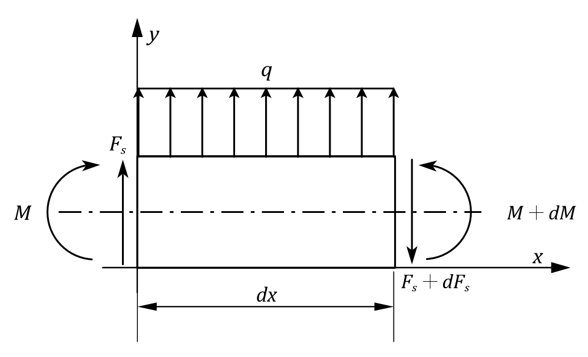

### 载荷集度q，剪力Fs，弯矩M之间的关系

* 如图对微梁段建立力的平衡方程
$$
\sum F_{iy} = 0,~F_s+qdx+(-F_s-dF_s) = 0 \\
\sum M_{iz} = 0,~M+dM+(-M)+(\frac{1}{2}qdx^2)-(F_s+dF_s)dx = 0 \\
$$
* 略去其中存在两个微分量的高阶小量，得到化简后的方程组
$$
\sum F_{iy} = 0,~qdx+(-dF_s) = 0 \Rightarrow dF_s = qdx\\
\sum M_{iz} = 0,~dM-(F_s)dx = 0 \Rightarrow dM = F_sdx\\
$$
* 进一步化简为导数形式：
$$
\frac{dM}{dx} = F_s \\
\frac{dF_s}{dx} = q \\
\frac{d^2M}{dx^2} = q \\
$$
