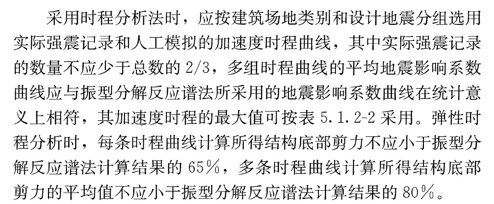
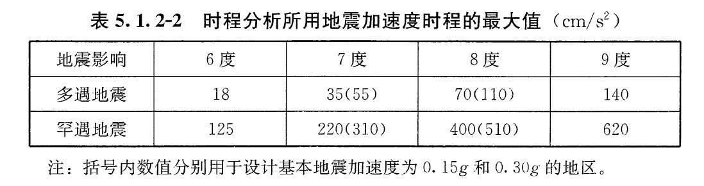

# 如何选波？
本文将整理相关文献中有关地震波选择的知识点，旨在教会所有初学者如何给结构选择合适的地震波进行分析。
## 根据《抗规》中相关规定如下：

* 由上述可以知道，地震波的选择主要从数量，统计意义，底部剪力三个角度做出要求
* 正确选择输入的地震波曲线还应当满足地震动的三要素：频谱特性，有效峰值，持续时间。
* 所谓统计意义相符，指的是所有地震波的地震影响系数曲线的曲线平均值与设计地震反应谱曲线吻合，两条曲线在结构前三阶振型周期对应的地震影响系数差值不大于20%。
### 加速度有效峰值
* 加速度有效峰值可以按下表选择
