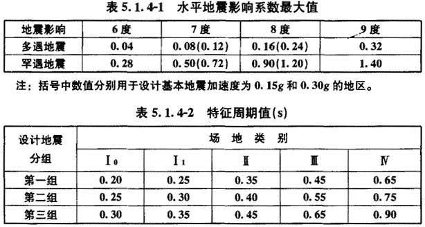
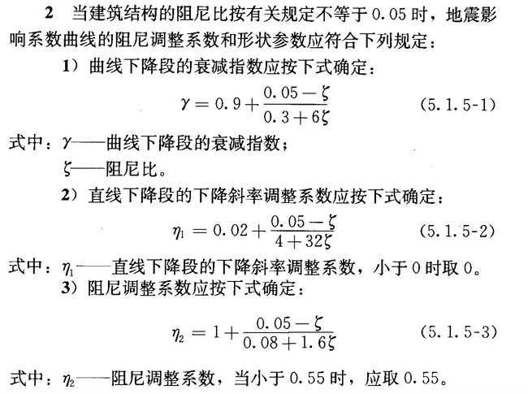
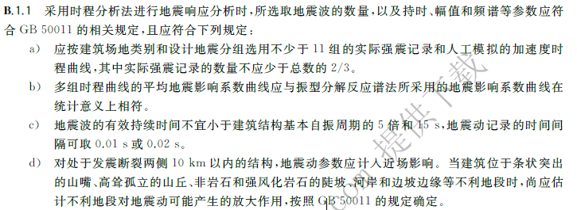
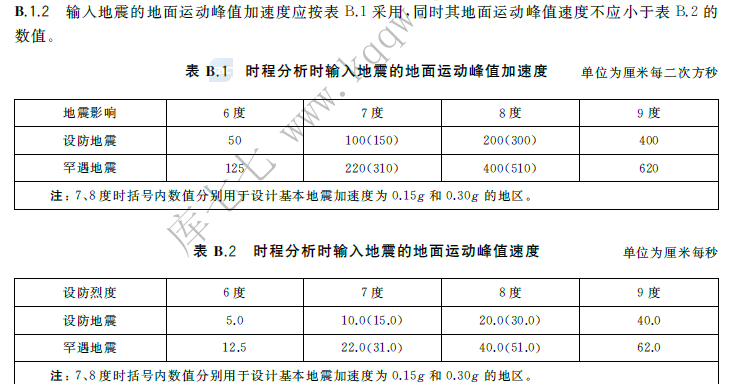

# PEER选波指导？
本文将整理相关资料中有关地震波选择的知识点。
## 生成设计地震反应谱
* 首先生成如下设计加速度反应谱，对于钢筋混凝土结构阻尼比一般取0.05。该谱线为弹性，小震？

* 《抗规》中相关规定如下：

* 至此我们已经得到了设计加速度反应谱。

## PEER初步选波
* 见链接
* https://zhuanlan.zhihu.com/p/351094750
## PEER二次筛选
* 正确选择输入的地震波曲线还应当满足地震动的三要素：频谱特性，有效峰值，持续时间。**（来自《抗规》的条文说明）**
* 如下分别为抗震规范和韧性评价规范弹塑性时程分析时对地震波选择的规定。

* 对于中国规范来说，地震波的选择主要从数量，统计意义，底部剪力三个角度做出要求

### 加速度有效峰值
* 加速度有效峰值可以按下表选择，第一张图中为抗震规范中，第二章为韧性评价规范中。

* 调幅系数？大震，中震，小震？
### 持续时间
* 有效持续时间：输入的地震加速度时程曲线的有效持续时间，一般从首次达到该时程曲线最大峰值的10％那一点算起，到最后一点达到最大峰值的10％为止；不论是实际的强震记录还是人工模拟波形，有效持续时间一般为结构基本周期的(5～10)倍，即结构顶点的位移可按基本周期往复(5～10)次。**（来自《抗规》的条文说明）**
* 如上图，有效持续时间不宜小于建筑结构基本自振周期的5倍和15s，地震动记录的时间间隔可取0.01s或0.02s。**（来自《韧规》）**
### 频谱特性
* 多组时程曲线的平均地震影响系数曲线应与阵型分解反应谱法所采用的地震影响系数曲线在统计意义上相符。**（来自《韧规》）**
* 阵型分解反应谱法为弹性分析阶段，小震/常遇地震？
* 所谓统计意义相符，指的是所有地震波的地震影响系数曲线的曲线平均值与设计地震反应谱曲线吻合，两条曲线在结构前三阶振型周期对应的地震影响系数差值不大于20%。**（来自《抗规》的条文说明）**

## 参考
[1] 崔济东的博客 http://www.jdcui.com/?p=2948