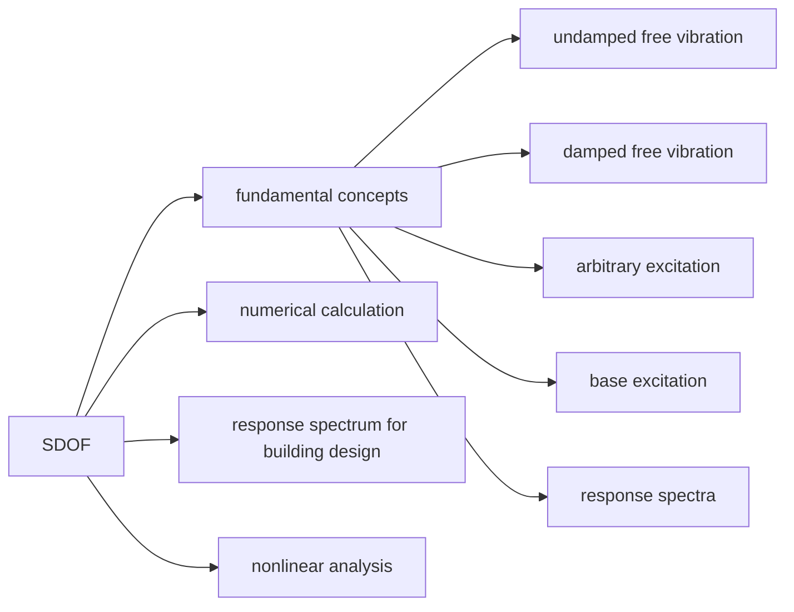
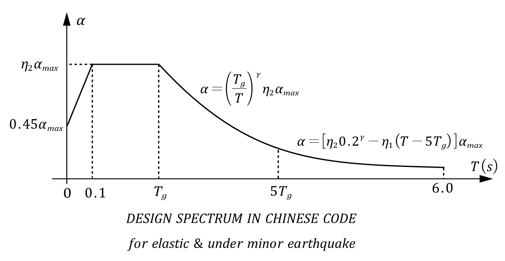

# SDOF & MDOF Systems
## 1. SDOF systems


### 1.1 Fundamental Concepts
* **Undamped Free Vibration**
    $$
    m\ddot{x}+kx = 0 \\
    make~\frac{k}{m} = \omega^2\\
    the~solution~is:~x(t) = A\sin(\omega t)+B\cos(\omega t) \\
    replacing~the~initial~conditions:~ x|_{t=0} = x_0,~\dot{x}|_{t=0} = \dot{x}_0 \\
    x(t) = \frac{v_0}{\omega} \sin(\omega t) + x_0 \cos(\omega t)
    $$
    * $\omega$ is frequency in radians
    * $f=\frac{\omega}{2\pi}$ is frequency in cycles
    * $T=\frac{1}{f}$ is period in seconds
* **Damped Free Vibration**
    $$
    m\ddot{x}+c\dot{x}+kx = 0
    $$
    * Movement tends to decrease with time. This reduction is associated with loss of energy present in the systems. Energy, kinetic or potential, transforms in other forms of energy. In dynamic systems this loss of energy is know as **damping**.
    ```mermaid
    graph LR
    A[damping]-->B[viscous damping]-->B1[proportional to movement velocity]
    A-->C[coulomb]-->C1[caused by friction]
    A-->D[hysteretic]-->D1[for material working in the nonlinear range where loading curve is different from the unloading curve]
    ```
    * damping ratio $\xi = \frac{c}{c_c} = \frac{c}{2\sqrt{mk}}$\\
    ```mermaid
    graph LR 
    A["$$\xi$$"]-->B[larger than 1]-->B1[there is no vibration]
    A-->C[equal to 1]-->C1[there is no vibration]
    A-->D[less than 1]-->D2[vibration]
    ```
* **Arbitrary excitation**
    $$
    m\ddot{x}+c\dot{x}+kx = F(t)
    $$
    * One Method is that we can use **duhamel integral** to solve this equation, and the answer we get discribing the dispalcement of the structure. Although the answer is quite accurate but it is too complex to use in relaity, so we introduce another method - **spectrum method**.
    * In spectrum method, under a certain earthquake record we can get different dispalcement/velocity/acceleration response spectrum with different natural vibration period of structure. And we point out the maxium respone value for a certain structure natural vibration period, and then plot them out on one coordinate axis, which is called displacement/velocity/acceleration spectrum. For one earthquake wave we can get one displacement/velocity/acceleration spectrum responsed to it. For a certain place we can get many local earthquake record, thus, we have many displacement/velocity/acceleration response curve. Design spectrum is one simplyfied curve to envelope them all.
    ```mermaid
    graph TB
    A[location]-->B1[earthquake record 1]
    A-->B2[......]
    A-->B3[earthquake record n]-->C1[structure 1 $$~T_1$$]-->D1[time hisroty record 1]
    B3-->C2[......]-->D2[......]
    B3-->C3[structure i $$~T_i$$]-->D3[time history reccord i]
    D1-->E[maxium response value]
    D2-->E
    D3-->E
    E-->F[response spectrum for earthquake record n]
    B1-->E1[......]
    B2-->E2[......]
    E1-->F1[esponse spectrum for earthquake record 1]
    E2-->F2[esponse spectrum for earthquake record ...]
    F-->G[design response spectrum] 
    F1-->G
    F2-->G  
    ```
* **Base excitation**
    $$
    m\ddot{x}+c\dot{x}+kx = -m\ddot{x}_g \\
    \rightarrow \ddot{x}+2\xi \omega x + \omega^2x=-\ddot{x}_g
    $$
### 1.2 Numerical Calculation
* There are several methods that can be used to solve numerical integration of differential equations of motion, such as **mean acceleration method, linear acceleration, newmark-$\beta$ method and wilson-$\theta$ method**. 
* Mean acclelration method: suppose that the acceleration of the system varies linearly between two adjacent points.
$$
\ddot{x}(t)=\ddot{x}_{t_k-1}+\frac{\ddot{x}_{t_k}-\ddot{x}_{t_k-1}}{t_k-t_{k-1}}(t-t_{k-1})
$$
### 1.3 Response Spectrum For Building Design
* According to displacement of building structures under seismic actions, stiffness matrix is used to solve internal forces directly. This method requires a relatively accurate structure dynamic model.
* According to acceleration of building structures under seismic actions, the inertial forces are taken as the equivalent seismic effect on the structure. Then the static analysis is performed to calculate the internal forces of memebers.
* **Basic Formula for Horizontal Earthquake Action**
    $$
    a = \ddot{x}_g(t) + \ddot{x}(t) \\
    S_a = |a|_{max} \\
    F_{max} = S_a m \\
    then~make~F_{max} = \alpha G \\
    \alpha G = S_a m \Rightarrow \alpha = \frac{S_a m}{G} = \frac{S_a}{g} = \frac{|\ddot{x}_g|_{max}}{g} \frac{S_a}{|\ddot{x_g}|_{max}} = k\beta
    $$
    * Seismic Coefficient $k = \frac{|\ddot{x}_g|_{max}}{g}$
    Generally, this coefficient show the seismic intensity, the bigger the ground motion acceleration, so as the seismic coefficient.
    ```mermaid
    graph TB
    6-->0.05
    7-->0.1
    8-->0.2
    9-->0.4
    ```
    * Dynamic Coefficient $\beta = \frac{S_a}{|\ddot{x}_g|_{max}}$
    It reflect how much the maximum absolute acceleration is amplified due to dynamic effect.
    
### 1.4 Nonliear Analysis

## 2. MDOF systems
$$

$$