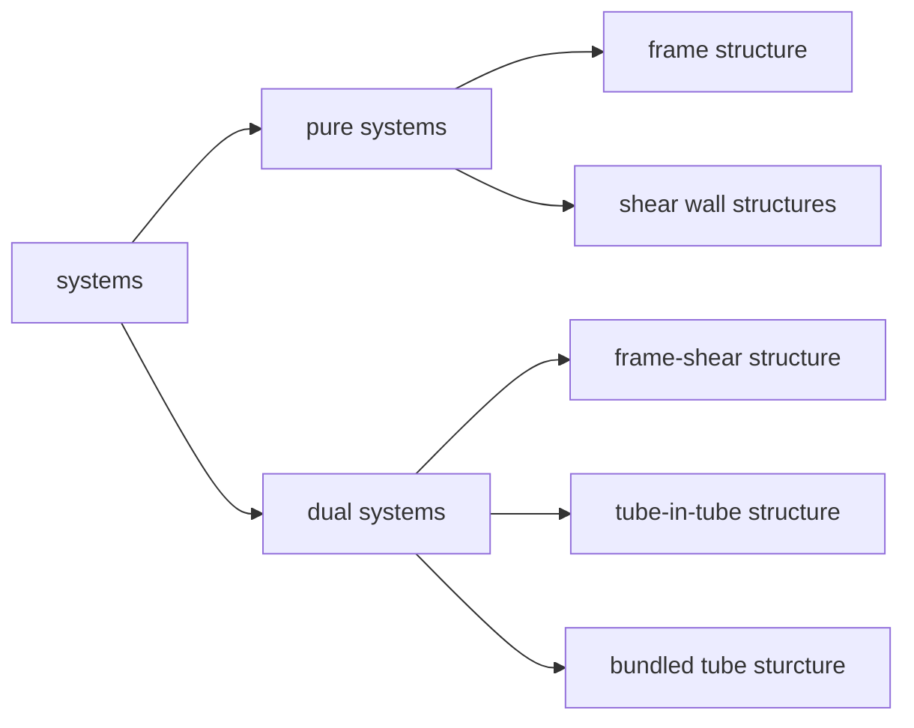
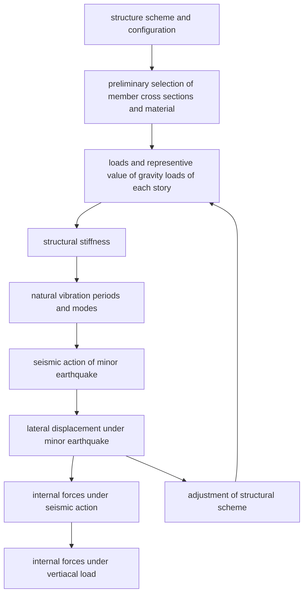

# Seismic Design of RC Structure

## Introduction
* The primary purpose of all structures used for building is to support gravity loads. However, building may also be subjected lateral forces due to wind or earthquake.

* **Frame Structure**
    * Frame structures make the building flexible in plane design and are commonly used in multistory RC building
    * Beams, columns, and supporting floors are continuous and meet at nodes, often called "rigid" point
* **Shear Wall Sturcture**
* **Dual Systems**
    * When RC frames interacting with RC or masonry wall together provide the necessary resistance to lateral forces, while each system carries its appropriate share of the gravity load, these types of structure sre variously known as dual, hybrid or wall-frame structures.

