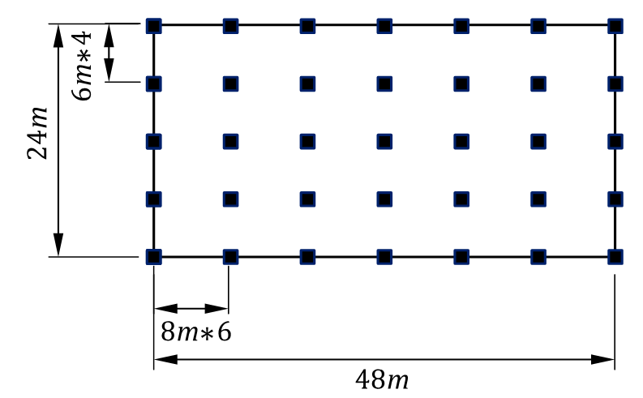
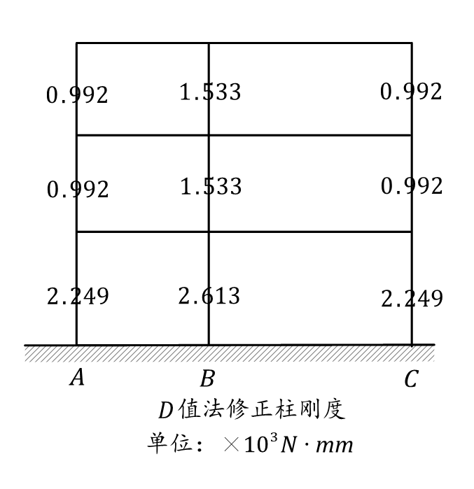

# 高层建筑课后作业
## 第4、5章
### 1. 简述高层建筑中剪力墙的作用以及对整体刚度的影响？
答：    
* 作用有以下几点：1. 承担竖向荷载。2.抵抗地震、风荷载等侧向作用。3.改变结构的变形特点，例如，框架结构为剪切型变形，而框架剪力墙结构为弯剪型变形。4.具有一定的耗能能力。
* 对整体刚度的影响有：1.对结构在剪力墙布置方向提供侧向刚度。2.为结构提供一定的扭转刚度。
### 2. 解释钢骨混凝土框架在高层建筑中的应用以及其和纯钢框架结构的优势对比？
答：    
* 应用：钢骨混凝土指在传统的钢筋混凝土内部包裹型钢。由于包裹的型钢，其抗压强度更强，可以承担更多的重力荷载，更加适合高层建筑建造；同时高层建筑对于侧向力更加敏感，钢骨混凝土框架由于其材料，抗侧刚度强，延性好适合高层建筑的建设。
* 对比：对于纯钢结构来说，其结构构件截面更小，建筑内部可利用空间大；同时结构自重会更轻一点。对于钢骨混凝土框架结构来说，由于构件的截面面积更大，弯曲剪切的刚度更大，承载能力也更强；同时截面面积大保证了构件的稳定性，减少了构件失稳破坏的可能性。
### 3. 在高层建筑设计中，为什么需要严格控制轴压比？请说明轴压比对高层建筑结构稳定性的影响？
答：
* 控制轴压比原因：钢筋混凝土结构的延性主要来自于钢筋的屈服，而当轴压比过大时，柱构件受弯时钢筋不会屈服，此时构件属于小偏压受弯破坏，为脆性破坏。故，为保证构件的延性，需要控制其轴压比。
* 影响：轴压比越大，高层建筑稳定性越差；轴压比越小，高层建筑稳定性越好
### 4. 简述高层建筑在地震作用下的剪压比调整原则及其对梁柱节点设计的影响？
答：
* 原则：当剪压比大于0.15时，梁的强度和刚度即有明显的退化现象，剪压比愈高则退化的愈快，混凝土破坏愈早，这时增加箍筋用量已经不能发挥作用了。因此必须限制截面的剪压比，实质上也是限制截面尺寸不能过小。
* 对节点设计的影响：为防止节点区在受剪时，混凝土的破坏先于箍筋的屈服，需要使得节点区的水平截面不能太小，配箍率不能太高，在设计中常常采用限制节点水平截面上的剪压比来实现这一个要求，当节点区剪压比大于0.35时，增加箍筋的作用已经不明显，这时需要增加节点水平截面尺寸来实现。
### 5. 跨高比对高层建筑梁的设计有何影响？为什么高层建筑中常常采用扁梁设计？
答：
* 影响：梁的跨高比对梁的抗震性能有明显影响。随着跨高比的减小，剪力的影响增大，剪切变形占全部位移的比重亦增大，梁的延性变差，呈现脆性破坏的现象。
* 采用扁梁原因：高层建筑自重大，同时高度高也意味着其受到的侧向力更大，故梁需要更大的截面高度来承担这些力产生的弯矩，而建筑由于使用功能的影响，往往对建筑层高有一定要求，因此为了同时满足高承载力和空间高度的要求，可以设计扁梁。
### 6. 解释双肢剪力墙如何通过连梁协调两侧墙肢的变形，在高层建筑中起到什么作用？
答：
* 当一侧墙肢受到外力作用产生变形时，由于连梁和这侧墙肢连接在一起其也会发生变形产生内力，同时连梁的内力又可以传递给另一侧墙肢，使得另一侧墙肢发生变形，此时连梁相当于另一侧墙肢的外力的来源，使得其和另一侧墙肢共同承担的外力作用，连梁就是通过其变形协调两侧墙肢的变形。
* 作用：在高层建筑中，连梁可以将各剪力墙连接为一个整体，增加结构的整体性，使其协同变形，共同承担侧向力。
### 7. 在高层建筑中，为什么开口剪力墙需要特别考虑剪力传递路径和局部刚度的增强？
答：
* 开口剪力墙使得原本的连续墙体中间被打断，使得开口处的抵抗剪力的面积减小，在开口处产生应力集中现象。
* 开口处由于截面的缺失使得其刚度大大降低，为了防止软弱层的出现，需要对开口处的刚度进行特别的加强。
### 8. 拟在7度区建一栋12层的高层办公楼，采用钢筋混凝土框架结构，底层层高为5m，其余层高为3.9m，东西向总长48m，柱间距8m，南北向总长24m，柱间距6m，各层楼面静载标准值均为5.5$kN/m^2$，活荷载标准值为$kN/m^2$，混凝土材料选用C35（$f_c = 16.7MPa$），试估算柱子的截面尺寸。
答：

计算结构总高，用于确定框架的抗震等级
$$
H = 3.9 \times 11 + 5 = 47.9m
$$

由于上海地区为7度设防地区，同时根据《抗规》相关规定，故该框架为二级框架，轴压比取0.75。同时考虑地震作用，在取柱轴压力设计值时取地震作用组合下的轴压力设计值，在此例中即对重力荷载代表值乘以1.2的分项系数，同时假定柱子截面均为正方形截面，故计算过程如下表。
$$
\frac{N}{f_cA} \leq 0.75   
\\A \geq \frac{N}{0.75f_c}
$$
| 楼层 | 上部楼面/屋面板数 | 楼面/屋面荷载重力荷载代表值/$kN$ | 重力荷载代表值设计值/$kN$ | 单根柱轴压力设计值/$kN$ | 最小截面面积/$mm^2$ | 计算最小截面尺寸/$mm$ |
| :--- | :---------------- | :------------------------------- | :------------------------ | :---------------------- | :------------------ | :-------------------- |
| 1    | 12                | 93312                            | 111974.4                  | 3199.268571             | 273675.6691         | 523.1402002           |
| 2    | 11                | 85536                            | 102643.2                  | 2932.662857             | 250869.3633         | 500.8686088           |
| 3    | 10                | 77760                            | 93312                     | 2666.057143             | 228063.0576         | 477.5594806           |
| 4    | 9                 | 69984                            | 83980.8                   | 2399.451429             | 205256.7518         | 453.0527031           |
| 5    | 8                 | 62208                            | 74649.6                   | 2132.845714             | 182450.446          | 427.1421848           |
| 6    | 7                 | 54432                            | 65318.4                   | 1866.24                 | 159644.1403         | 399.5549278           |
| 7    | 6                 | 46656                            | 55987.2                   | 1599.634286             | 136837.8345         | 369.9159831           |
| 8    | 5                 | 38880                            | 46656                     | 1333.028571             | 114031.5288         | 337.6855472           |
| 9    | 4                 | 31104                            | 37324.8                   | 1066.422857             | 91225.22302         | 302.0351354           |
| 10   | 3                 | 23328                            | 27993.6                   | 799.8171429             | 68418.91727         | 261.5701001           |
| 11   | 2                 | 15552                            | 18662.4                   | 533.2114286             | 45612.61151         | 213.5710924           |
| 12   | 1                 | 7776                             | 9331.2                    | 266.6057143             | 22806.30576         | 151.0175677           |

由于处于一、二、三级抗震等级时，矩形截面柱的边长不宜小于400mm，故实际柱子截面尺寸取值如下：
| 楼层         | 1   | 2   | 3   | 4   | 5   | 6   | 7   | 8   | 9   | 10  | 11  | 12  |
| ------------ | --- | --- | --- | --- | --- | --- | --- | --- | --- | --- | --- | --- |
| 柱边1长/$mm$ | 550 | 550 | 500 | 500 | 500 | 450 | 400 | 400 | 400 | 400 | 400 | 400 |
| 柱边2长/$mm$ | 550 | 550 | 500 | 500 | 500 | 450 | 400 | 400 | 400 | 400 | 400 | 400 |
### 9.  如图所示三层框架结构，混凝土强度为C30，其中柱截面尺寸均为400mm×400mm，梁截面尺寸均为250mm×600mm，所受水平荷载每层均为30kN，要求：（1）用反弯点法求内力图（2）用D值法求内力图（3）用D值法求框架顶侧移

答：
1. 采用反弯点法

| 梁     | 截面宽 | 截面高 | 跨度/mm | 惯性矩Ib | 线刚度   |
| :----- | :----- | :----- | :------ | :------- | :------- |
| AB间梁 | 250    | 600    | 6000    | 4.50E+09 | 2.25E+10 |
| BC间梁 | 250    | 600    | 9000    | 4.50E+09 | 1.50E+10 |

| 柱编号   | 截面宽 | 截面高 | 层高 | 惯性矩Ic | 线刚度   | 抗侧刚度 |
| :------- | :----- | :----- | :--- | :------- | :------- | :------- |
| 底层柱   | 400    | 400    | 5000 | 2.13E+09 | 1.28E+10 | 6.14E+03 |
| 一般层柱 | 400    | 400    | 4500 | 2.13E+09 | 1.42E+10 | 8.43E+03 |

由于各层柱抗侧刚度均相同，因此层间剪力均匀分布。
| 层号 | 水平荷载 | 层间剪力 | $d_a / \sum d$ | $d_b / \sum d$ | $d_c / \sum d$ | $V_a$ | $V_b$ | $V_c$ |
| ---- | -------- | -------- | -------------- | -------------- | -------------- | ----- | ----- | ----- |
| 3    | 30       | 30       | 0.333          | 0.333          | 0.333          | 10    | 10    | 10    |
| 2    | 30       | 60       | 0.333          | 0.333          | 0.333          | 20    | 20    | 20    |
| 1    | 30       | 90       | 0.333          | 0.333          | 0.333          | 30    | 30    | 30    |

2. 采用D值法

| 一般层 | K           | alpha       | 未修正刚度kN/mm | 修正刚度kN/mm |
| :----- | :---------- | :---------- | :-------------- | :------------ |
| 中柱   | 0.444839858 | 0.181950509 | 8427.983539     | 1533.475899   |
| 边柱   | 0.266903915 | 0.117739403 | 8427.983539     | 992.3057542   |

| 底层 | K           | alpha       | 未修正刚度kN/mm | 修正刚度kN/mm |
| :--- | :---------- | :---------- | :-------------- | :------------ |
| 中柱 | 0.610749186 | 0.425452277 | 6144            | 2613.97879    |
| 边柱 | 0.366449511 | 0.366139023 | 6144            | 2249.558156   |

 
 

| 层号 | 水平荷载kN | 层间剪力kN | $D_a / \sum D$ | $D_b / \sum D$ | $D_c / \sum D$ | $V_a~kN$ | $V_b~kN$ | $V_c~kN$ |
| ---- | ---------- | ---------- | -------------- | -------------- | -------------- | -------- | -------- | -------- |
| 3    | 30         | 30         | 0.316          | 0.367          | 0.316          | 9.48     | 11.01    | 9.48     |
| 2    | 30         | 60         | 0.282          | 0.436          | 0.282          | 16.92    | 26.16    | 16.92    |
| 1    | 30         | 90         | 0.282          | 0.436          | 0.282          | 25.38    | 39.24    | 25.38    |

A柱
| 层号 | K           | y0   | y1  | y2     | y3     | y     |
| ---- | ----------- | ---- | --- | ------ | ------ | ----- |
| 3    | 0.266903915 | 0.20 | 0   | 0      | 0      | 0.200 |
| 2    | 0.266903915 | 0.47 | 0   | 0      | -0.025 | 0.445 |
| 1    | 0.366449511 | 0.77 | 0   | -0.025 | 0      | 0.745 |

B柱 
| 层号 | K           | y0   | y1  | y2  | y3  | y     |
| ---- | ----------- | ---- | --- | --- | --- | ----- |
| 3    | 0.444839858 | 0.27 | 0   | 0   | 0   | 0.270 |
| 2    | 0.444839858 | 0.45 | 0   | 0   | 0   | 0.450 |
| 1    | 0.610749186 | 0.73 | 0   | 0   | 0   | 0.730 |

C柱
| 层号 | K           | y0   | y1  | y2     | y3     | y     |
| ---- | ----------- | ---- | --- | ------ | ------ | ----- |
| 3    | 0.266903915 | 0.20 | 0   | 0      | 0      | 0.200 |
| 2    | 0.266903915 | 0.47 | 0   | 0      | -0.025 | 0.445 |
| 1    | 0.366449511 | 0.77 | 0   | -0.025 | 0      | 0.745 |

1. 框顶侧移计算

| 层号 | 层剪力N | 柱a，D值kN/mm | 柱b，D值kN/mm | 柱c，D值kN/mm | 总D值kN/mm  | 层间侧移/mm | 楼层侧移/mm |
| :--- | :------ | :------------ | :------------ | :------------ | :---------- | :---------- | :---------- |
| 3    | 30000   | 992.3057542   | 1533.475899   | 992.3057542   | 3518.087407 | 8.527360616 | 38.23480176 |
| 2    | 60000   | 992.3057542   | 1533.475899   | 992.3057542   | 3518.087407 | 17.05472123 | 29.70744114 |
| 1    | 90000   | 2249.558156   | 2613.97879    | 2249.558156   | 7113.095101 | 12.65271991 | 12.65271991 |

## 第6章
### 1. 框架-剪力墙结构的侧移曲线有什么特点？与刚度特征值的关系如何？
答：
* 框架剪力墙的侧移曲线呈现反s形的弯剪型位移曲线
* 刚度特征值是反映总框架和总剪力墙刚度比值的一个参数，当刚度特征值较小时，说明总剪力墙的等效刚度处于主导地位，结构侧移曲线向弯曲型发展；当刚度特征值较大时，说明总框架的刚度占主导地位，结构侧移曲线向剪切型发展。
### 2. 框架-剪力墙结构中，剪力墙的布置原则有哪些？这些原则对结构性能有何影响？
答：
* 剪力墙的布置应当遵循“均匀、分散、对称、周边”的原则。
* “均匀、分散”指剪力墙布置的数量应当较多，且均匀、分散的布置在结构平面上，使得结构在布置平面内受力均匀。
* “对称”指剪力墙在平面上应当均匀布置，使得剪力墙的受力中心线和刚度中心接近，减小结构的扭转作用。
* “周边”指剪力墙应当布置在建筑平面周边，因为这样可以最大程度的发挥剪力墙的抗扭性能。
### 3. 描述框架-剪力墙结构在水平荷载作用下，框架和剪力墙之间的荷载分配机制。
答：
* 在水平力作用下，框剪结构的剪力分配随楼层高度所处高度变化而变化。在框剪结构的下部楼层中，由于剪力墙位移小，拉住了框架的变形，使得在底部楼层中剪力大部分由剪力墙承担；而在上部结构中，由于剪力墙的位移越来越大，框架的变形反而越来越小，故框架除了要承担自身由于水平力产生的剪力外，还要负担拉回剪力墙变形的附加剪力，故在上部结构中由于水平力产生的楼层剪力很小，而框架中仍然有相当数量的剪力。
### 4. 框剪结构有哪些计算简化方式？不同的计算简化中框架和剪力墙是如何连接的？
答：
* 计算简化假定：
  * 楼板在自身平面内的刚度无限大。这一假定保证楼板将整个计算区段内的框架和剪力墙连成一个整体，在水平荷载作用下，框架和剪力墙之间不产生相对位移。
  * 当结构体系规则，剪力墙布置比较均匀时，结构在水平荷载作用下不计扭转的影响，反之则要考虑扭转的影响。
  * 不考虑剪力墙和框架柱的轴向变形以及基础的转动
* 计算简化方式：刚接体系和铰接体系。
  * 铰接体系中，各剪力墙沿一个方向布置，楼板的作用仅仅是保证各片平面结构具有相同的位移，但楼面外刚度非常小，不起到约束弯矩的作用，因此可以将楼板看作铰接的连杆，总框架和总剪力墙之间通过铰接连杆相连。
  * 刚接体系中，各剪力墙沿着不同方向布置，给楼板提供了平面外的刚度，使得楼板可以约束剪力墙的转动，楼板成为连接总框架和总剪力墙之间的一端刚接一端铰接的连杆。
### 5. 总剪力墙和总框架的内力是如何分配计算的？
答：
* 剪力墙内力分配计算：由框架-剪力墙协同工作原理可以解得侧移曲线，从而求解得到总剪力墙在不同高度处的弯矩和剪力，按照各片墙的等效抗弯刚度进行分配可以得到各片墙的内力。
* 框架梁、柱的内力分配，由于无论是刚结模型还是铰接模型，与总框架相连的部分始终为铰接节点，因此总框架内只有剪力作用，故可按各柱的抗侧移刚度D值把总剪力分配到各柱上，为了简化计算，这里近似地取各层柱的中点作为反弯点位置。计算出柱端弯矩后可以利用力的平衡方程解得梁端弯矩。
### 6. 总框架的D值和Cf值的物理意义各是什么？两者之间有什么关系？
答：
* D值指使框架柱两端产生相对侧移时所需要的剪力；Cf值指使总框架在楼层间产生相对单位剪切变形时所需要的水平剪力
* 关系如下公式：
  $$
  C_f = hD = h\sum D_j
  $$

### 7. 铰接体系和刚接体系在计算步骤上有什么不同？
答：
* 铰接体系：
  * 先将铰接体系中的连杆切开，建立协同工作微分方程。先取总剪力墙为脱离体，按照悬臂构件的方式写出内力与弯曲变形的微分方程；再写出总框架的弯曲变形的微分方程，根据计算假定，总框架和总剪力墙具有相同的侧移曲线，将；两个微分方程写为一个总方程。
  * 根据外力条件的不同可以求解出该微分方程的解，得到侧移曲线的方程，并进一步得到剪力墙的弯矩和剪力，通过图表绘制结果，利用查表方式得到。
* 刚接体系：
  * 根据连梁对剪力墙的约束弯矩，重新写出框架剪力墙微分方程，形式与铰接体系类似，但是这其中由于剪力墙刚接的原因，刚度特征值的计算与铰接体系不同。
  * 在查表时，得到的剪力墙内力包含了连梁的作用，需要求出连梁的约束作用力大小后，再进行扣除。
### 8. 框架-剪力墙结构抗震设计时需要根据框架部分进行哪些调整？
答：
* 框架部分承受的地震倾覆力矩不大于结构总地震倾覆力矩的10%，按剪力墙结构设计，其中框架部分应当按框架-剪力墙结构的框架设计。
* 当框架部分承受的地震倾覆力矩大于结构总地震倾覆力矩的10%但不大于50%时，按框架-剪力墙结构设计
* 当框架承部分承受的地震倾覆力矩大于结构总地震倾覆力矩的50%但不大于80%时，按框架-剪力墙结构设计，其中最大适用高度可比框架结构适当增加，框架部分的抗震等级和轴压比限值宜按照框架结构的规定。
* 当框架部分承受的地震倾覆力矩大于结构总地震倾覆力矩的80%时，应当按框架-剪力墙结构进行设计，但最大适用高度宜按框架结构采用，框架部分的抗震等级和轴压比限值应按框架结构的规定采用。
### 9. 某6层住宅,层高3m。每层自重为3250kN,每层结构布置相同,如图所示。抗震设计烈度为7度,Ⅳ类场地,设计地震分组为第二组，结构基本自振周期为1.12s。柱截面尺寸全部为400mm×400mm,混凝土强度等级为C30。梁截面尺寸全部为250mm*400mm,混凝士强度等级为C20。剪力墙厚度为200mm,混凝土强度等级为C30。计算横向地震作用下(Y向)框架-剪力墙的内力。

* 框架刚度计算

| 柱截面特性计算 |      | E    | 30000    | mPa  |          |
| :------------- | :--- | :--- | :------- | :--- | :------- |
| 层数           | b/mm | h/mm | Ic/mm4   | H/mm | ic/Nmm   |
| 1              | 400  | 400  | 2.13E+09 | 3000 | 2.13E+10 |
| 2              | 400  | 400  | 2.13E+09 | 3000 | 2.13E+10 |
| 3              | 400  | 400  | 2.13E+09 | 3000 | 2.13E+10 |
| 4              | 400  | 400  | 2.13E+09 | 3000 | 2.13E+10 |
| 5              | 400  | 400  | 2.13E+09 | 3000 | 2.13E+10 |
| 6              | 400  | 400  | 2.13E+09 | 3000 | 2.13E+10 |

| 梁截面特性计算 |      | E    | 25500    | mPa  |          |
| :------------- | :--- | :--- | :------- | :--- | :------- |
| 层数           | b/mm | h/mm | Ic/mm4   | H/mm | ib/Nmm   |
| 1              | 250  | 400  | 1.33E+09 | 4500 | 7.56E+09 |
| 2              | 250  | 400  | 1.33E+09 | 4500 | 7.56E+09 |
| 3              | 250  | 400  | 1.33E+09 | 4500 | 7.56E+09 |
| 4              | 250  | 400  | 1.33E+09 | 4500 | 7.56E+09 |
| 5              | 250  | 400  | 1.33E+09 | 4500 | 7.56E+09 |
| 6              | 250  | 400  | 1.33E+09 | 4500 | 7.56E+09 |
  
各层柱D值计算

| 楼层     | 中柱     |          |          |          |          | 边柱     |             |          |          |          |
| :------- | :------- | :------- | :------- | :------- | :------- | :------- | :---------- | :------- | :------- | :------- |
| 总ib/Nmm | ic/Nmm   | K        | alpha    | D        | 总ib/Nmm | ic/Nmm   | K           | alpha    | D        |          |
| 6        | 3.02E+10 | 2.13E+10 | 7.08E-01 | 2.62E-01 | 7.44E+03 | 1.51E+10 | 21333333333 | 3.54E-01 | 1.50E-01 | 4.28E+03 |
| 5        | 3.02E+10 | 2.13E+10 | 7.08E-01 | 2.62E-01 | 7.44E+03 | 1.51E+10 | 21333333333 | 3.54E-01 | 1.50E-01 | 4.28E+03 |
| 4        | 3.02E+10 | 2.13E+10 | 7.08E-01 | 2.62E-01 | 7.44E+03 | 1.51E+10 | 21333333333 | 3.54E-01 | 1.50E-01 | 4.28E+03 |
| 3        | 3.02E+10 | 2.13E+10 | 7.08E-01 | 2.62E-01 | 7.44E+03 | 1.51E+10 | 21333333333 | 3.54E-01 | 1.50E-01 | 4.28E+03 |
| 2        | 3.02E+10 | 2.13E+10 | 7.08E-01 | 2.62E-01 | 7.44E+03 | 1.51E+10 | 21333333333 | 3.54E-01 | 1.50E-01 | 4.28E+03 |
| 1        | 1.51E+10 | 2.13E+10 | 7.08E-01 | 4.46E-01 | 1.27E+04 | 7.56E+09 | 21333333333 | 3.54E-01 | 3.63E-01 | 1.03E+04 |
  
总框架剪切刚度计算，根据下表结果为1.05E+09 Nmm
| 楼层 | 中柱     | 边柱     |          |
| :--- | :------- | :------- | :------- |
| D    | D        | Cf       |          |
| 6    | 7.44E+03 | 4.28E+03 | 9.20E+08 |
| 5    | 7.44E+03 | 4.28E+03 | 9.20E+08 |
| 4    | 7.44E+03 | 4.28E+03 | 9.20E+08 |
| 3    | 7.44E+03 | 4.28E+03 | 9.20E+08 |
| 2    | 7.44E+03 | 4.28E+03 | 9.20E+08 |
| 1    | 1.27E+04 | 1.03E+04 | 1.71E+09 |

* 剪力墙刚度计算
  
| $\mu $   | 1.2  | E    | 30000  |       |           |            |          |
| :------- | :--- | :--- | :----- | :---- | :-------- | :--------- | :------- |
| 墙体代号 | b/mm | h/mm | Aw/mm2 | H/mm  | Iw /mm4   | EIeq       | sumEIeq  |
| 1        | 200  | 4500 | 900000 | 18000 | 6.075E+12 | 1.8225E+17 | 7.29E+17 |
| 2        | 200  | 4500 | 900000 | 18000 | 6.075E+12 | 1.8225E+17 | 7.29E+17 |
| 3        | 200  | 4500 | 900000 | 18000 | 6.075E+12 | 1.8225E+17 | 7.29E+17 |
| 4        | 200  | 4500 | 900000 | 18000 | 6.075E+12 | 1.8225E+17 | 7.29E+17 |
  
  总刚度为2.916E+18N/mm，计算得到刚度特征值为0.3418

* 地震作用计算
  场地为IV类场地，场地自振周期为0.75s，阻尼比为0.05，且结构基本自振周期为1.12s，采用7度设防，故水平地震系数最大值为0.08，采用底部剪力法简单计算结构底部剪力如下：
  $$
  \alpha_1 = 0.08 \times (\frac{0.75}{1.12})^{0.9} = 0.056\\
  F_{EK} = \alpha_1 G_{eq} = 0.056 \times 0.85 \times (3250 \times 6) = 928.2 kN
  顶层附加地震作用为:\\
  \delta F_n = (0.08T_1 +0.07) F_{EK} = (0.08\times1.12+0.07)\cdot 928.2 = 148.14 kN
  $$

| 楼层数       | 层高m | 楼层重kN | 层重*层高 | 层重*层高权重 | 地震集中力kN | 底部弯矩kNm |
| :----------- | :---- | :------- | :-------- | :------------ | :----------- | :---------- |
| 6            | 18    | 3250     | 58500     | 0.285714286   | 371.0142857  | 6678.257143 |
| 5            | 15    | 3250     | 48750     | 0.238095238   | 185.7285714  | 2785.928571 |
| 4            | 12    | 3250     | 39000     | 0.19047619    | 148.5828571  | 1782.994286 |
| 3            | 9     | 3250     | 29250     | 0.142857143   | 111.4371429  | 1002.934286 |
| 2            | 6     | 3250     | 19500     | 0.095238095   | 74.29142857  | 445.7485714 |
| 1            | 3     | 3250     | 9750      | 0.047619048   | 37.14571429  | 111.4371429 |
  
  将地震荷载等效为倒三角形荷载，结果为q = 118.586kN,结果如下

| 层数         | 层高        | x/H         | Mw/M0 kN/m | Mw       | Vw/V0 kN | Vw        | Vf kN       |
| :----------- | :---------- | :---------- | :--------- | :------- | :------- | :-------- | :---------- |
| 6            | 18          | 1           | -0.02      | -256.146 | -0.02    | -21.3455  | 0           |
| 5            | 15          | 0.833333333 | 0.03       | 384.219  | 0.3      | 320.1825  | 5.929305556 |
| 4            | 12          | 0.666666667 | 0.13       | 1664.949 | 0.55     | 587.00125 | 5.929305556 |
| 3            | 9           | 0.5         | 0.22       | 2817.606 | 0.75     | 800.45625 | 0           |
| 2            | 6           | 0.333333333 | 0.42       | 5379.066 | 0.87     | 928.52925 | 20.15963889 |
| 1            | 3           | 0.166666667 | 0.67       | 8580.891 | 0.96     | 1024.584  | 13.04447222 |
  
## 第七、八、九章
### 1.简述筒体结构体系的基本定义和主要特点。
答：
* 基本定义：筒体结构建筑是由一个或几个密柱形筒体构成高耸空间抗侧力及承重结构的高层建筑。
* 主要特点：具有很高的竖向承载和和侧向承载力。单一的筒体为单一的抗侧力系统，难以形成多重抗震防线，往往复合其他结构体系形成多重抗震防线，而对于核心筒结构可以开洞使其成为强肢弱梁的破坏形式。

### 2.什么是剪力滞后现象？在框筒结构中该现象有什么影响？
* 根据材料力学，当侧向力作用于箱型结构时，箱型结构截面的正应力均线性分布，其应力在翼缘方向为矩形，在腹板方向为一拉一压两个三角形，但是当侧向力作用于框筒结构时，正应力并不是线性分布的，而是呈非线性分布，即正应力在角柱部分大，在中部逐渐减小，这种现象就被称为剪力滞后现象。
* 影响：由于剪力滞后效应的影响，角柱内的轴力加大，而远离角柱的柱子则由于剪力滞后现象仅有较小的力，不能充分发挥材料的作用，也减小了结构的空间整体抗侧刚度。

### 3.水平加强层在筒体结构中的作用是什么？
答：
* 由于筒体由于刚度较大，往往被利用在高层以及超高层建筑中，而由于水平位移在高度上的叠加，最后导致结构顶部水平位移很大。因此可以采用水平加强层，将筒体和外柱相互连接，约束周边框架和核心筒的变形，减小结构与水平荷载下的侧移量，并使各竖向构件的变形趋向均匀，较少楼盖结构翘曲。

### 4.筒体结构的高度限值和高宽比是如何确定的？
答：
* 高度限值和高宽比都是根据当地的抗震设防烈度查表确定。

### 5.什么是筒体结构中的“转换梁”？它在何种情况下设置？
答：
* 含义：建筑物某楼层的上部与下部因平面使用功能不同，该楼层上部与下部采用不同结构（设备）类型，并通过该楼层进行结构（设备）转换，则该楼层称为结构（设备）转换层。
* 当竖向受力构件（一般为柱子）无法将力直接传递至地面时，或者上下层柱子不对齐，轴线不对正时可以设置转换层，这和“转换梁”的定义接近。

### 6.列举筒体结构体系在高层建筑中的典型应用案例。
答：
* 有西尔斯大厦，上海中心大厦，迪拜哈里法塔，上海环球金融中心等等

### 7.调谐质量阻尼器（TMD）在高层建筑结构中的减振机理是什么？
答：
* 当TMD的振动频率和主结构频率接近的时候，就相当于在结构振动时，TMD会施加给结构一个相反的惯性力，抵消结构在某个方向上的振动，达到结构的减振效果。
### 8.在上海拟建一高层办公楼，总高控制在200m，共58层。场地红线范围为60mx60m。试提出结构方案设计和说明。包括：
* 确定结构抗侧力体系和楼盖体系；
* 结构平面尺寸和主要抗侧力结构构件的布置；给出主要结构构件的尺寸，并给出规范规定的基本要求，如截面轴压比、体积配箍率、纵筋配筋最大值、最小值、钢筋直径、箍筋间距、边缘构件等的具体限值要求；并简单说明其目的； 
* 画出结构平面示意图、立面示意图。

**答**：
* 由于建筑高度高，受到的抗侧力大，对建筑抗侧力要求高，因此采用框架核心筒结构比较合适；楼盖体系采用现浇梁板体系结构。
* 规范基本要求：上海地区设防烈度为7度，且建筑高度高达200m，因此抗震等级为二级框架，二级核心筒。
* 构件尺寸以及相关要求
  * 框架柱。尺寸: 建议尺寸为800mm x 800mm；根据《高层建筑混凝土结构技术规程》（JGJ 3-2010），轴压比不宜大于0.6；根据轴压比和混凝土强度等级确定，一般不小于1.0%。
  * 核心筒墙。建议墙体厚度不小于300mm；轴压比不宜大于0.5；体积配箍率，不小于1.2%。
  * 梁。纵筋配筋率**，不宜大于2.5%，不应小于0.2%；最小直径，一二级钢筋直径不宜小于2Φ14。
  * 箍筋。间距，不应大于200mm，直径不小于8mm；边缘构件，约束边缘构件的箍筋直径不小于8mm，间距不大于100mm（一级）或150mm（二级）。
  * 上述要求的目的是控制构件和结构的延性和抗震性能。
* 简单示意图如下

