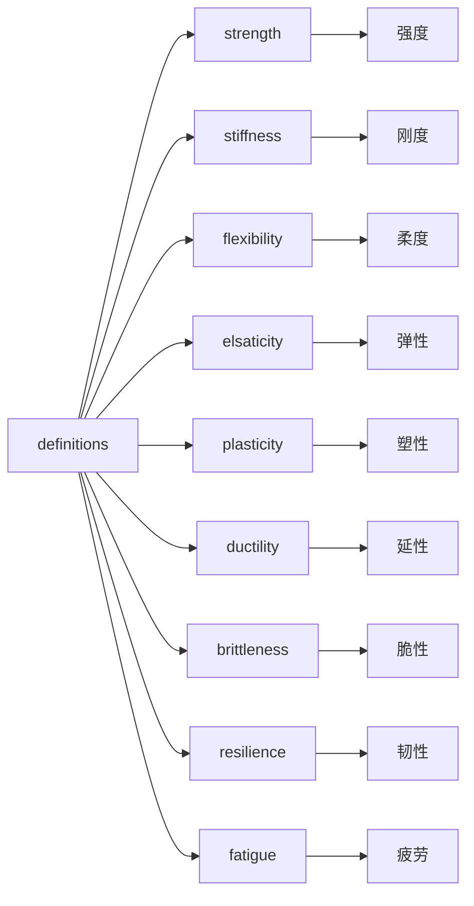

# SOME IMPORTANT DEFINITIONS
## Overview

## Strength
* 在外力作用下，材料抵抗破坏的能力。
## Flexibility & Stiffness
* 柔度指，材料/构件/结构在单位力作用下产生的位移；刚度指，材料/构件/结构在单位位移下产生的力。
## Elasticity & Plasticity
* 弹性指，材料/构件/结构在发生变形后能够恢复原来的大小和形状的性质；塑性指，材料/构架/结构发生变形后不能再能够恢复为原来的大小和形状的性质。
## Ductility & Brittleness
* 延性指，材料/构件/结构在达到我们所认为的破坏形状后还能够继续保持承载直到达到极限承载力的能力；脆性指，材料/构件/结构在外力作用下，仅仅产生很小的变形就发生破坏的性质。
## Reilience
* 材料/构件/结构在塑性变形和破裂过程中产生吸收能量的能力，表现为力-位移/应力-应变曲线所围成的面积。
## Fatigue
* 材料/构架/结构在远低于强度甚至屈服极限的力的作用下发生破坏的现象。