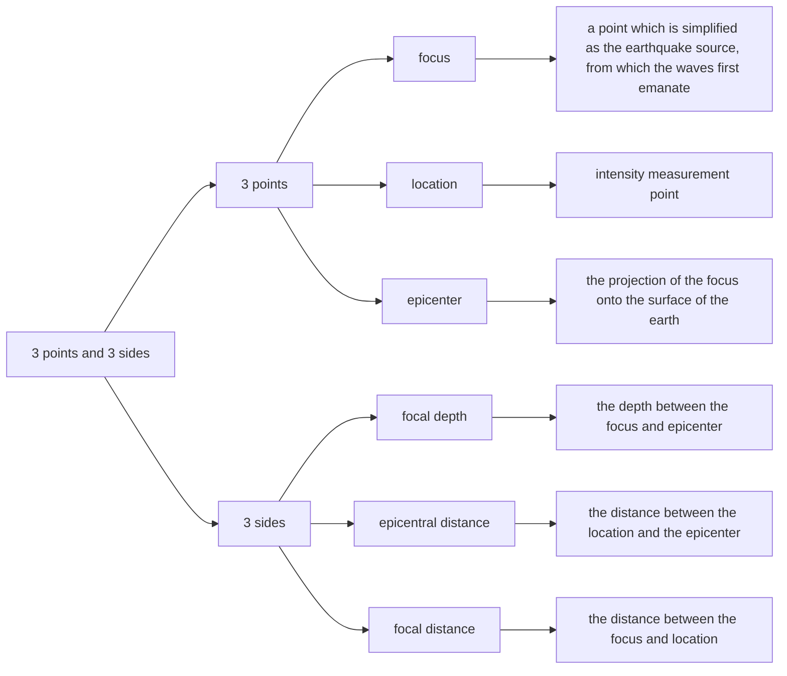
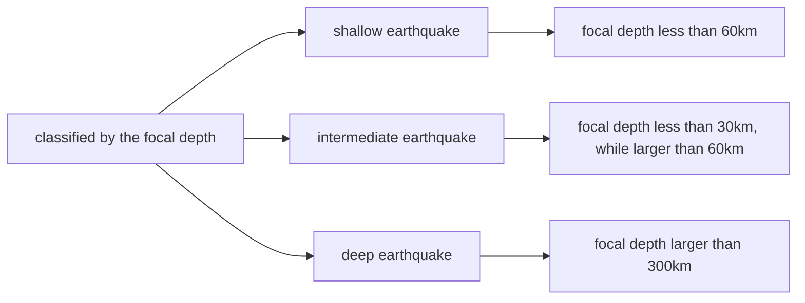
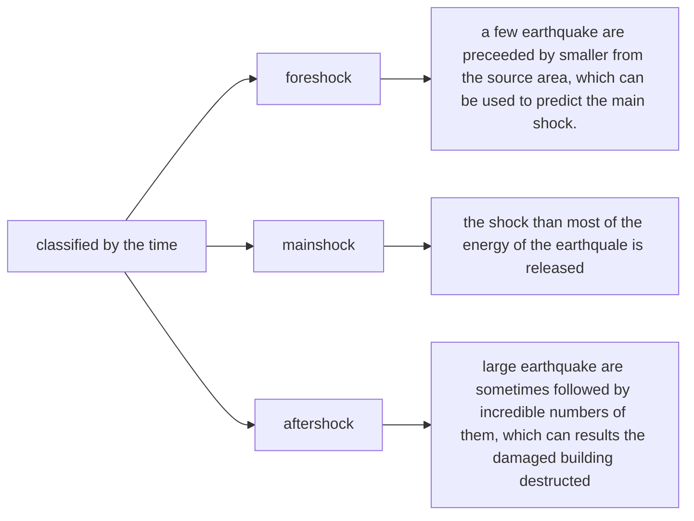
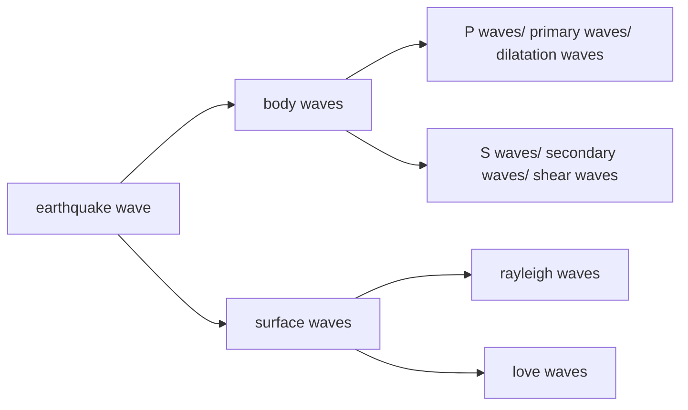

#Earthquake and Cround Motions
## 1 Causes and Types of Earthquakes
### 1.1 Earth's tectonics
### 1.2 Causes of Earthquakes
* Natural phenomena include: plate moving; volcanic activity; collapse
* Human-induced phenomend include: large reservoir-induced earthquake; nuclear explosion-induced earthquake.

### 1.3 Terminology

-------------------------------------------------------------------------------

----------

----------------------------------------------------------------------------------------

## 2 Seismic Waves and Propagation

* Bodywaves, originating at the rupture zone and tarveling with a body of solid rock.
* Surfacewaves, which motion is mainly at or near ground surface.
### 2.1 P waves
* P waves travel parallel to the direction of propagation of the wave
* the motion of P waves alternately pushes and pulls the rock.
* P waves are able to travel through both soild rock and liquid material.
### 2.2 S waves
* S waves prduce an up-and-down and side-to-side motion of the earth that shakes the ground vertically and horizontally at right angle to the direction of wave travel.
* S waves cannot propagate in the liquid parts of the earth, and their amplitude is signficantly reduced in liquefied soil.
### 2.3 Rayleigh Waves
* Rayleigh wave moves both vertically and horizhontally in a vertiacl plane, in which the waves are traveling and exhibit elliptic movement.
### 2.4Love Waves
* Love waves moves the ground side to side in a horizontal plane parallel to the earthl' surface. There is no vertical displacement.
### 2.5 propagation velocity
* P waves > S waves > surface waves

## 3 Earthquake Record
```mermaid
graph LR
A[earthquake record]-->B[three time histories]
A-->C[three features]
B-->B1[dispalcement]
B-->B2[velocity]
B-->B3[acceleration]
C-->C1[PGA]
C-->C2[contents of the frequency spectrum]
C-->C3[duration time]
``` ****