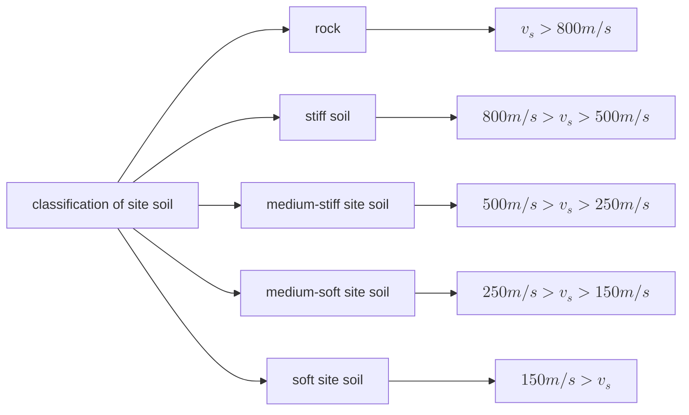

# Site Subsoil and Foundation
## 1 Classificaiton of Site Soil
* The site soil should be classified according the **shear wave** velocity of the soil layer

$$
v_{se} = \frac{d_0}{t} \\
t = \sum {\frac{d_i}{v_{si}}} \\
v_{se}:~ the~equivalent~shear~wave~velocity~of~soil~layer \\
d_0:~calculation~depth,~equas~to~20m~but~no~larger~than~the~thickness~of~the~overlaying~layer
$$
* If no measured data of shear wave velocity for Building Type C to D is avaliable, the soil may be calssified according to the characteristic value of force bearing capacity of subsoil in kPa.

## 2 Construction Site Categories
* Construction site category shall be classified into five categories according to the equivalent shear wave velocity and the overlaying thickness at the site.
* **The overlaying thickness means the distance from the surface to the top of the soil with $v_{se}$ > 500m/s, or the distance from the surface of the ground to the top of subsoil with $v_{se}$ > 400m/s and larger than 2.5 times to the near top soil beneath 5m lower from ground.**
* Construction Site Categoried: $I_0, I_1, II, III, IV$, **when the number grows the construction site is going to be more stiff**

