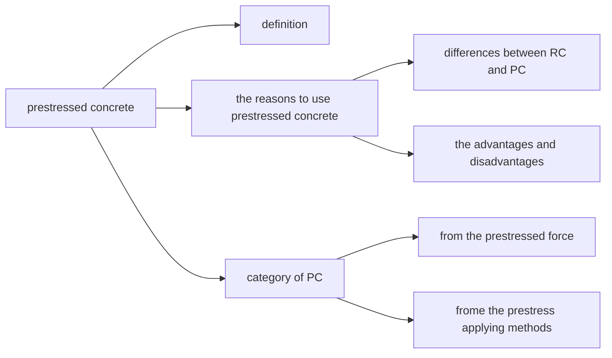
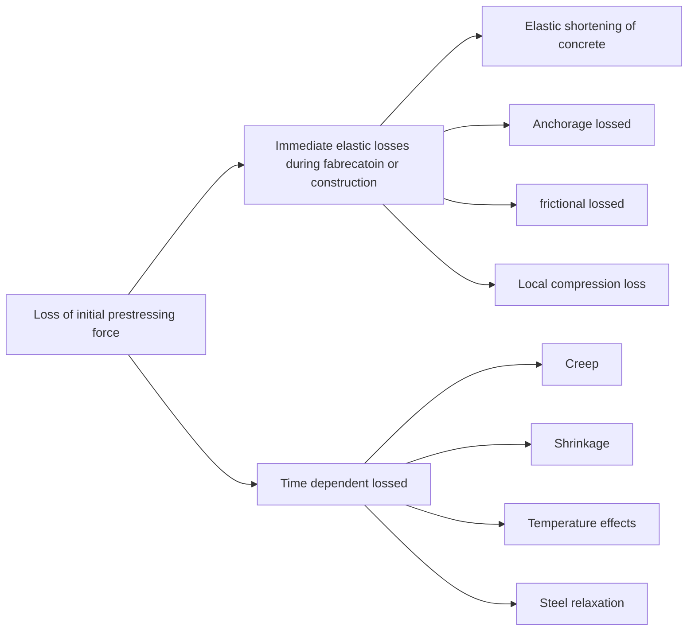

# PRESTRESSED CONCRETE
## overview of the topic

## Definition
* Prestressing is the deliberate creation of internal stresses in a structure or system to improve its performance.
* A prestressed concrete member is one in which there have been introduced internal stresses of such a magnitude, and also distribution, that the stressed resulting from external loading are counteracted to a desired degree.

## The Reasons to Use PC
### Differences between RC and PC
* Tensil Strength: For RC, tensile strength is assumed be negligible; for PC, 
### Advantage of Prestressed Concrete
* High strength steel & concrete
* Lighter section, longer spans
* Entire section is active
* Creckless
* Deflection control
* Better shear resistance
* Inherent safety
* Indirect long-term savings is large
### Disadvantage of Prestressed Concrete
* Higher material costs
* Prestressing is an added cost
* Formworking is more complex than RC
* not as ductile as RC

### Loss of Prestress

* **01 Anchorage Loss $l_1$**
As the load is transferred to the achorage device in prestressing construction, a slight inward movement of the tendon will occur as the wedge seat themselves, as the 
* **02 Frictional Loss $l_2$**

* **03 Temperature Loss $l_3$**

* **04 Relaxation Loss $l_4$**

* **05 Creep and Shrinkage Loss $l_5$**

* **06 Local Compression Loss $l_6$**
* **Combination of Prestress Losses**
$f_{lI}$: losses occur before the concrete is pre-compressioned;
$f_{lI}$: losses occure after the concrete is pre-compressioned.

