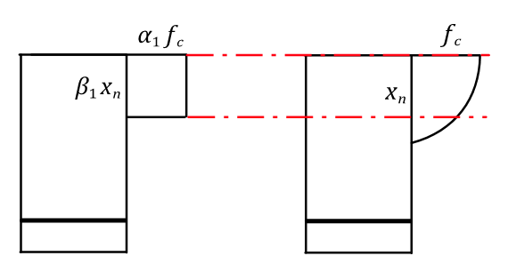

# FLEXURE
## 1. some overview of this topic

-------------------------------------------------------------------------------------

--------------------------------------------------------------------------------------

--------------------------------------------------------------------------------------
## 2. Three failure modes
### 2.1 situation 01
* In this situation, beams have large steel percentage. **The concrete will crush before the tensile steel yield.** This beam is known as an **over-reinforcement beam**.
* This is a sudden/brittle failure
### 2.2 situation 02
* In this situation, the percentage of steel of the beam is appropriate. **The reinforcement yields before the concrete crushes.** Before repture, large plastic deformation happens accompanied by apparent prepagation of cracks. This beam is called as **under-reinforcement beam**
* This is the desirable situation
### 2.3 situation 03
* In this situation, the reinforcement is not enough. When the concrete in tansion zone is crack, the steel cannot stand the sudden appeared force.  ** The tensile steel will rupture before the concrete crush. **
* Only one widely opened crack is observed, which rapidly propagates upwards and split the beam. And the ultimate strength is governed by the tensile strength of concrete and the size of the member.
--------------------------------------------------------------------------------------
## 3. Basic Assumptions
### 3.1 Assumption: Plane Remain Plane Assumption
### 3.2 The Tension force of Concrete is Ignored
* Tensile strength of concrete is neglected in calculation of flexural strength.
### 3.3 Perfect Bond 
* The strain in then reinforcement is equal to the strain in the concrete at the same level.
### 3.4 The Constitutive Law of the Material
* for concrete undercompression
$$
when~ \varepsilon \leq \varepsilon_0:~\sigma_c = f_c [1-(1-\frac{\varepsilon}{\varepsilon_0})^n] \\
when~ \varepsilon > \varepsilon_0:\sigma_c = f_c
$$
* for concrete under tension:
$$
when~ \varepsilon \leq \varepsilon_0:~ \sigma_t = vE_c \varepsilon \\
when~ \varepsilon > \varepsilon_{t0}~while~\varepsilon \leq 2\varepsilon_{t0}: \sigma_t = f_t =
$$
* for reinforcement under tension
$$
when~ \varepsilon \leq \varepsilon_y:~ \sigma = E_s\varepsilon \\
when~ \varepsilon > \varepsilon_y:~ \sigma = f_y
$$
## 4. Analysis of SRS
### The Whole proccess
* When the strain of the bottom reach $\varepsilon_{tu}$, assume they'll cracks and quits working. The concrete in compression and steel both work elastically.
* Then, for under-reinforcement member the reinforcement will yield.
* After that, the concrete in compression zone will crash, which means the member is failed.
### Equivalent Stress Block

* Equivalent condition: equal resultant compressive force; the same acting point of the resultant compressive.
* $\alpha_1 f_c$; $x=\beta_1 x_n$
### Basic Equation
* The reason make the calculation complex is that the concrete in the compressive zone will go into the elasticoplastic situation, the stress-strain will be a curve, so in the uppon part we transform it into a equivalent stress block to simplify the calculation. Here show the simplified ultimate limit state.
  
  $$
  \sum N = 0, \alpha_1 f_c x b = f_y A_s\\
    \sum M = 0, M_u = \alpha_1 f_c x b (h_0 - \frac{x}{2}) = f_y A_s (h_0 - \frac{x}{2})\\
    (x~is~unknown~and~use~the~equations~above~we~can~get~the~answer)
  $$
  make:
  $$
  \xi = \frac{x}{h_0} \rightarrow x = \frac{f_y A_s}{\alpha_1 f_c b} \rightarrow \xi = \frac{f_y A_s}{\alpha_1 f_c h_0 b} = \frac{f_y \rho_s}{\alpha_1 f_c}
  then:
  $$
$$
x = \frac{f_y A_s}{\alpha_1 f_c b}\\
M_u = f_y A_s (h_0 - \frac{f_y A_s}{2\alpha_1 f_c b}) \\
M_u = f_y A_s h_0 (1-\frac{f_y A_s}{2 \alpha_1 f_c b h_0}) = f_y A_s h_0(1-\frac{\xi}{2})
$$

### Balanced Section
* Balanced section is defined as a section that fail with the tension steel yielding and simultaneously the extreme compressive strain in concrete reaches 0.0033.
* When the size of the section is confirmed, the balanced section'll be certained with the steel percentage reach a certain value.
$$
\xi_{nb}=\frac{x_{nb}}{h_0} = \frac{\varepsilon_{cu}}{\varepsilon_{cu} + \varepsilon_y} \\
\xi_{b}=\frac{x_b}{h_0} = \frac{\beta_1 x_{nb}}{h_0} = \beta_1 \times \frac{1}{1+\frac{\varepsilon_y}{\varepsilon_{cu}}} \\
when~f_{cu} < 50 N/mm^2 \\
\xi_b = \frac{0.8}{1+\frac{f_y}{0.0033E_s}}
$$
* Then we can get the conclusion shown above.

### About the $\rho_{max}$ and $\rho_{min}$
* $\rho_{max}$ make the beam a under reinforcement beam, avoiding the brittle failure. 
$$
\frac{x}{h_0} \leq \xi_b \\
$$
* $\rho_{min}$ make the the reinforcement do not rupture before the compression zone crash 
$$
M_{cr} = 0.322 f_t b h_0^2 \\
M_y = f_y A_s(h_0 - \frac{x_n}{3}) \approx f_y A_s \times0.9h_0
\Rightarrow \rho_{min} = 0.45\frac{f_t}{f_y}
$$
--------------------------------------------------------------------------------------
## 4. Analysis of DRS
### 4.1 The Advantages
* **Reduced sustained load deflections:** Creep of concrete in compression zone; transfer load to compression steel; reduced stress in concrete; less creep; less sustained load deflection.   
* **Increase ductility:** reduced stress block depth; increase steel strain; larger curvature are obtained.**Since the after the compressoin reinforcement is yield, the strength of the steel won't decrease immediately.** 

* **Change failure mode from compression to tension:** 
* **Eases in fabrication:** use corner bars to hold & anchor stirrups.
### 4.2 DRS Simplified Methods
$$
\alpha_1 f_cbx+f_y'A_s' = f_y A_s \\
M_u = \alpha_1 f_c b x (h_0 - \frac{x}{2}) + f_y'A_s'(h_0-a_s') \\
then,~make~ A_s = A_{s1} + A_{s2}
$$
* $A_{s1}$ balance the compression force of concrete.
* $A_{s2}$ balance the compression force of reinforcement.
$$
\alpha_1f_cbx+f_y'A_s' = f_y A_{s1} + f_y A_{s2} \\
M_u = M_{u1} + M_u' \\
M_{u1} = \alpha_1f_c bx (h_0 - \frac{x}{2}) = f_y A_{s1} (h_0 -\frac{x}{2}) \\
M_{u2} = f_y' A_s' (h_0 - a_s') = f_y A_{s2} (h_0 - a_s')
$$
* **To make the compression reinforcement yield**, $ x \geq 2a_s'$, otherwise make $x = 2a_s'$.
$$
M_u = f_y A_s h_0 (1-\frac{a_s'}{h_0})
$$

### 4.3 Tee Section
