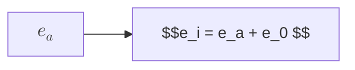

# ECCENTRICALLY LOADED MEMBERS
## Failure Modes
### Compression Failure
### Tension Failure
## Additional Eccentricity

## Moment Magnigying Coefficient
## Large Eccentricity Column Section
## Small Eccentricity Column Section
## Balanced Section
## N-M Interaction Diagram