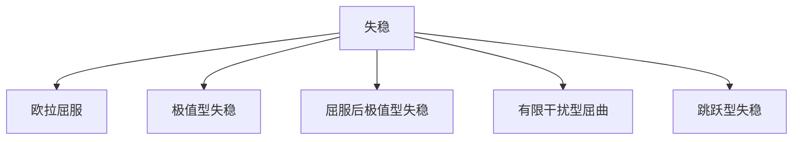

# 钢结构可能的破坏形式
* 钢结构的可能破坏形式有如下几种：**整体失稳；局部失稳；塑性破坏；脆性断裂；疲劳破坏；损伤积累破坏**
## 整体失稳破坏
* 稳定性定义:结构在荷载作用下处于平衡位置，微小外界扰动使其偏离平衡位置，若外界扰动除去后仍能恢复到初始平衡位置，则是稳定的；若外界扰动除去后不能恢复到初始平衡位置的，但仍能停留在新的平衡位置，则为临界状态，也称随遇平衡。
* 结构整体失稳破坏是指作用在结构上的外荷载尚未达到按材料强度计算得到的结构破坏荷载时，整个结构偏离原来的平衡位置进而可能导致坍塌。

* 欧拉屈曲（第一类失稳）：
    理想轴压杆（材料均匀弹性、杆件笔直、轴力始终与杆件轴线重合、两端铰接）
* 极值型失稳（第二类失稳）：
    非理想状态轴压杆件，考虑各种缺陷
* 屈服后极值型失稳
* 有限干扰型屈曲
* 跳跃型失稳