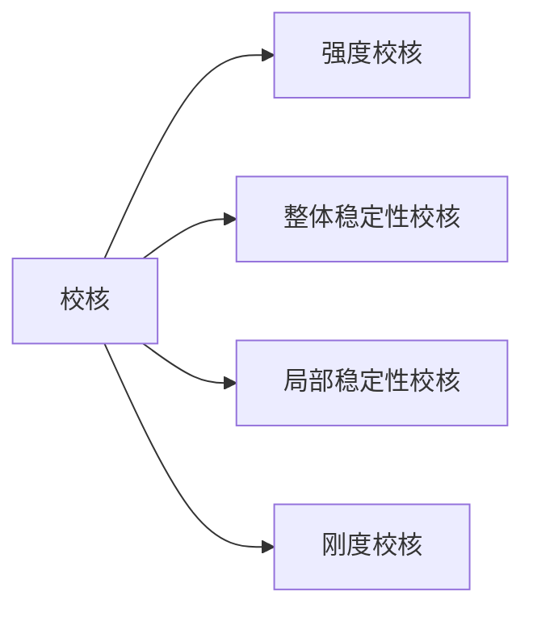

# 轴心受压构件

## 整体稳定校核
### 实腹式构件
* 单轴对称
* 双轴对称
### 格构式构件

## 局部稳定校核
### 实腹式构件
* **板件的弹性阶段的临界应力**
    板件因支承条件不同，在轴心受压时的均匀压应力作用下的临界应力也不同。
    * **简支矩形板**
        有公式 $N_{xcr} = \frac{\pi^2 D}{b^2} (\frac{mb}{a}+\frac{n^2 a}{mb})$ ，其中n为沿着y轴的半波数，m为沿着x轴的半波数。显然当$n=1$时该公式有最小值，因此当板屈曲时，沿y方向只有一个半波数。而对于m则要则要根据$\frac{a}{b}$的值的不同分类讨论。$N_{xcr} = k \frac{\pi^2D}{b^2}$,$k = (\frac{mb}{a}+\frac{a}{mb})^2$, $k$称为板的稳定系数，当板屈服时，沿$X$方向总是有$k$为最小的半波数。
    * **三边简支，与压力平行的一边为自由的矩形板**

    * **三边简支，与压力平行的一边有卷边的矩形板**
    * **其他支承条件矩形板**
* **板组中板件的弹性阶段的临界应力**
* **轴心受压实腹构件的局部稳定计算**
        构件内应力小于构件整体失稳时的临界应力，通过保证构件整体失稳后于局部失稳的发生就可以导出关于构件局部稳定的宽厚比限值，具体公式如下：
### 格构式构件
* 格构式构件局部稳定的验算内容如三：受压构件单肢截面板件的局部稳定、受压构件单肢自身的稳定、以及缀条的稳定。
* **受压构件单肢截面板件的局部稳定**
    计算采用之前局部稳定计算公式，利用宽厚比进行限制。
* **受压构件单肢自身的稳定**
    单肢自身的稳定性应当保证不低于受压构件的整体稳定性，应使$\lambda_1 \le 0.7 \lambda_{max}$。 
* **缀条的稳定**
    