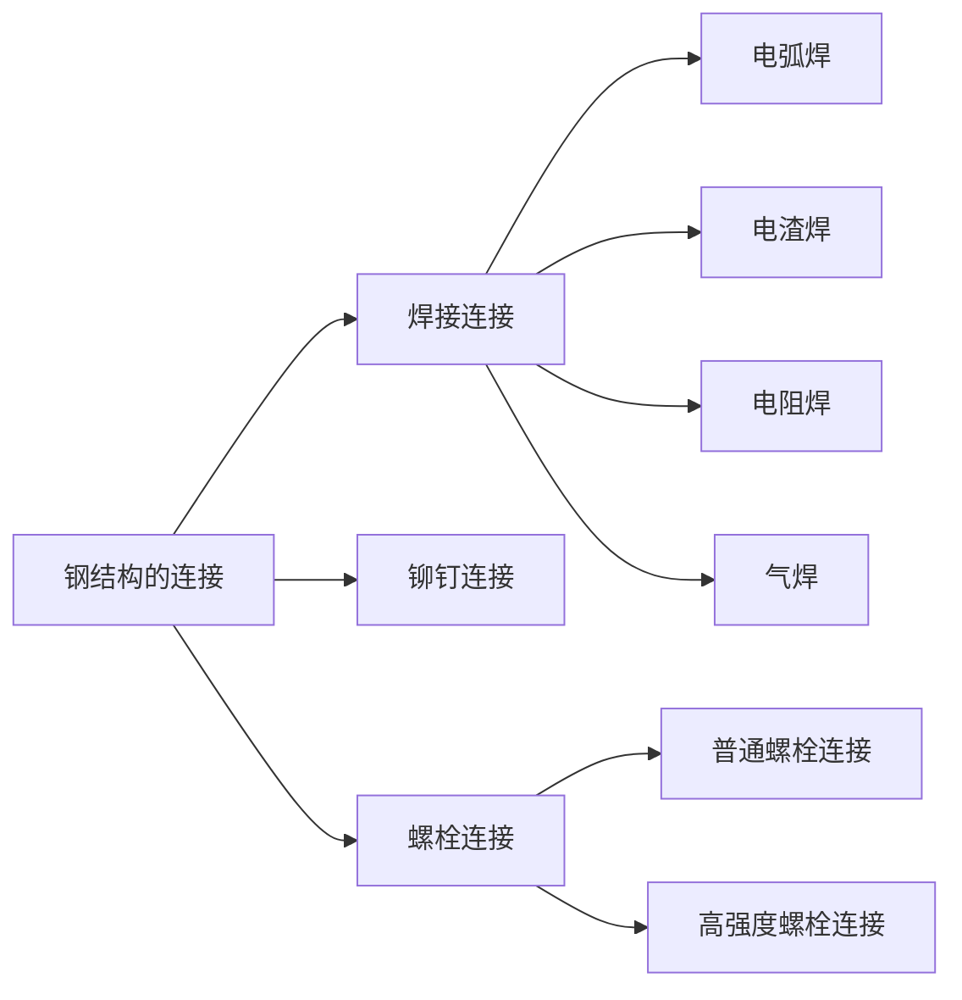

# 钢结构的连接

* 焊接连接：任何形状的结构都可以用焊缝连接，构造简单；但是，焊缝质量受材料和操作的影响，对钢材的材性要求比较高
* 铆钉连接：需要在构件上开孔，用加热的铆钉进行铆合，有时也用常温的铆钉进行铆合，但需要较大的铆合力。废工废钢；但是连接可靠，韧性和塑性好，质量易于检查，对经常承受动力荷载作用，荷载较大和跨度较大的结构有时仍然采用锚接结构。
* 螺栓连接：有普通螺栓和高强度螺栓之分。
## 焊缝连接形式
### 对接焊缝
* 对接焊缝三级检验：三级检验，只要求通过外观检验；二级检验，要求通过外观检验和超声波探伤检查；一级检验，要求通过外观检查、超声波探伤检查和x射线检查。
* 轴心受力对接焊缝检查
$$\sigma = \frac{N}{l_w t} \le f^w_t/f^w_c$$
* 斜向受力对接焊缝检查
$$\sigma = \frac{N\sin \theta}{l_w t} \\
\tau = \frac{N\cos\theta}{l_w t}$$
* 剪力作用对接焊缝检查
* 一般计算公式如下。
$$\tau = \frac{VS_w}{I_wt}$$
* 对于梁柱节点处的牛腿，可以假定剪力全由腹板承担，并且剪力均匀分布
$$\tau = \frac{V}{A_w}$$
* 弯矩和剪力共同作用对接焊缝检查
$$ \sigma_m = \frac{M}{W_w} \\
\sigma_1 = \sigma_m \frac{h_0}{h} \\
\tau_1 = \frac{VS_1}{I_wt} \\
\sqrt{\sigma_1^2 + 3 \tau_1^2} = 1.1f_t^w
$$
* 弯矩、轴力和剪力共同作用对接焊缝检查
$$ \sqrt{(\sigma_N + \sigma_{M1})^2 + 3 \tau_1^2} \le 1.1f_t^w $$
### 角焊缝
* 轴心力作用下
$$ N_1 = N \sin\theta \\
V = N \cos \theta \\
\sigma_f = \frac{N_1}{\sum h_e l_w} \\
\tau_f = \frac{V}{\sum h_e l_w} \\
\sqrt{(\frac{N_1}{\beta_f\sum l_w h_w})^2+(\frac{V}{\sum l_w h_w})^2} \le f_f^w $$
$\beta_f$ 正面角焊缝的强度设计增大系数，直角角焊缝对于直接承受静力荷载或者间接承受动力荷载的，$\beta_f = 1.22 $，对于直接承受动力荷载和斜角角焊缝取1。
### 焊接应力

## 螺栓连接
### 普通螺栓
* 普通螺栓可分为拉力螺栓和剪力螺栓。当外力垂直于螺杆时为剪力螺栓，当外力平行于螺杆时为拉力螺栓。
* 剪力螺栓的5种破坏形式：螺杆剪切破坏；钢板孔壁挤压破坏；构件本身由于截面开孔过多而破坏；钢板端部的螺孔端距太小而被剪坏；钢板太厚而螺杆直径太小发生螺杆弯曲破坏。
* 拉力螺栓承载力计算公式
$$ N_t^b = \frac{\pi d_e^2}{d}f_t^b$$
* 剪力螺栓承载力计算公式
$$N_c^b = d \sum t f_c^b \\ N_v^b = n_v \frac{\pi d^2}{4}f_v^b \\ [N]_V^b = min \{ N_c^b,N_v^b \} $$
### 高强度螺栓