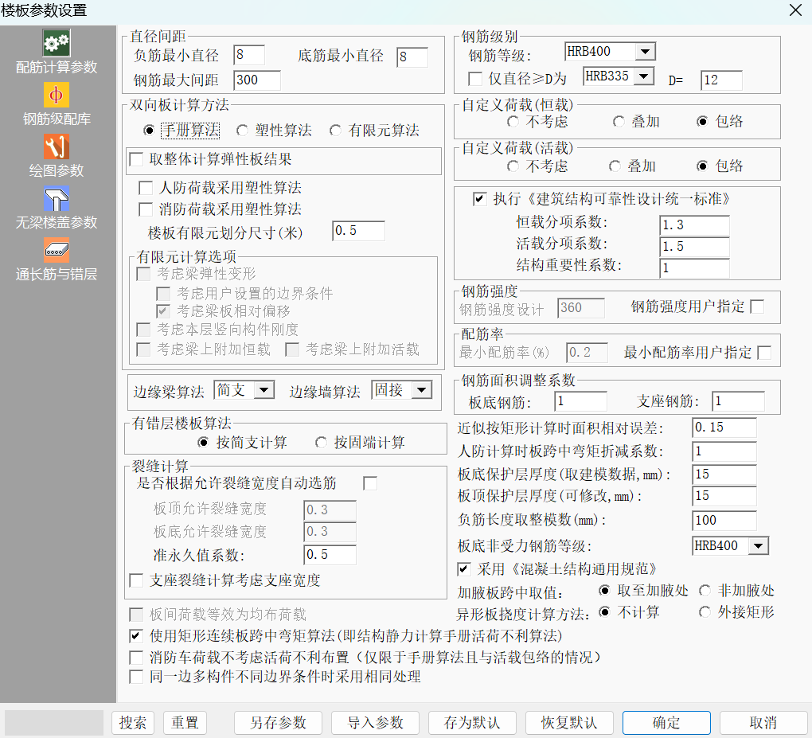
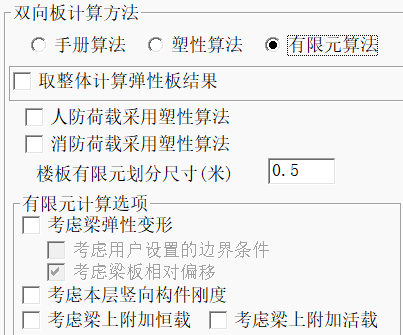
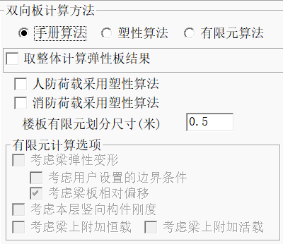
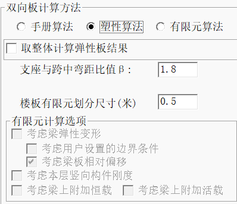

# 板施工图
* “板施工图”模块可以完成各层楼板施工图的辅助设计，可以独立完成钢筋混凝土楼板的计算以及配筋设计。其中可以设计的楼板形式有普通梁板结构、无梁楼盖、空心板、加腋板、压型钢板、叠合板等。
* 每自然层结构平面图设计操作主要分为以下三步：1.修改计算及绘图相关参数；2.计算钢筋混凝土板配筋；3.画结构平面施工图。
## 按照平法出图
## 计算参数
### 配筋计算参数

如图所示，依次介绍
* **负筋最小直径/底筋最小直径/钢筋最大间距(mm)** 
  * 这边的参数设置应当满足规范的构造要求。
* **双向板的计算方法选择**
  * 手册算法是按照《建筑结构静力计算手册》中板的弹性薄板算法；塑性计算方法是按照《建筑结构静力计算手册》中板的极限平衡法计算四边支承板；有限元方法是程序将全层的所有楼板板块均按照有限元算法计算。
  * 对于手册算法和塑性算法来说，各板块是分别计算其内力，不考虑相邻板块的影响，因此对于中间支座两侧，其弯矩值就有可能存在不平衡问题，对于跨度较大的情况这种不平衡弯矩的影响就更明显了。在这种情况下就可以采用有限元方法计算。
  * 相关选项如下图

### 钢筋级配库
### 绘图参数
#### 无梁楼盖参数
### 扩展设置