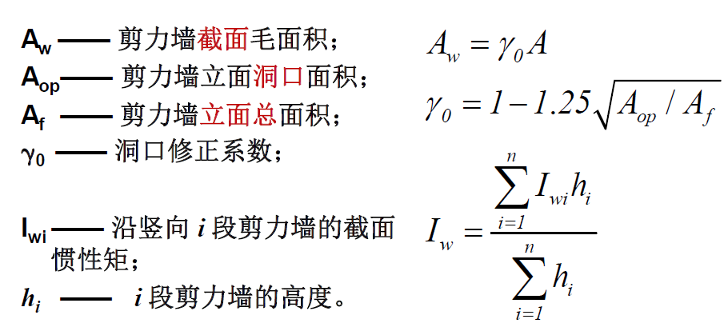
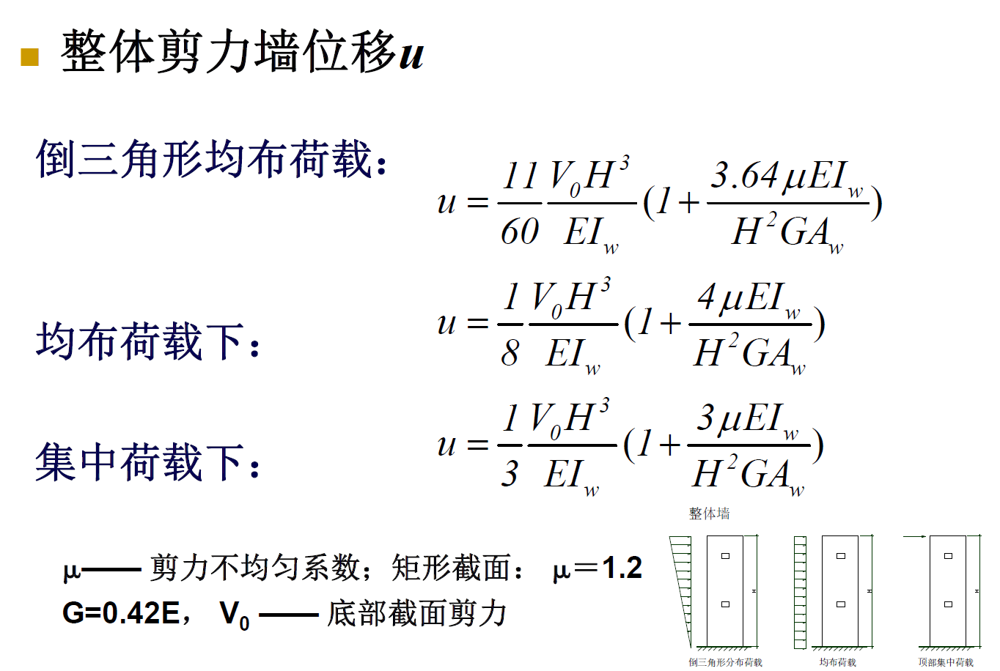
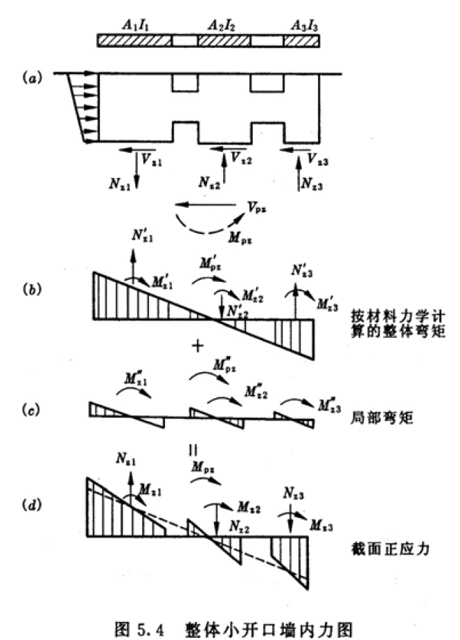
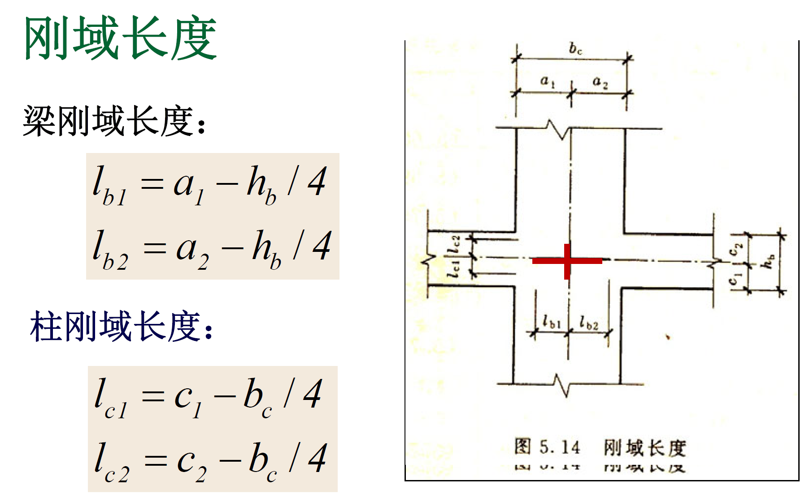

# 剪力墙结构
## 概述
* 根据材料可以分成，钢筋混凝土剪力墙结构，钢板剪力墙结构，钢支撑结构，钢骨混凝土结构
* 根据洞口大小可以分为，整体墙，整体小开口墙，双肢墙，多肢墙，壁式框架
* 钢筋混凝土剪力墙特点：
  * 墙体平面内刚度很大，平面外刚度很小。
  * 水平力和竖向力主要由墙平面内的抗侧强度抵抗。
  * 较经济，在我国得到广泛应用。
  * 建筑物高度得到提升。
  * 需合理布置，避免引起扭转。
  * 缺点是，室内分隔受到限制。
## 剪力墙结构的计算
### 整体墙的简化计算
* 采用悬臂柱的计算方式，采用如下假定
  * 单片墙，全高
  * 底部固定支座
  * 水平荷载下剪力墙的变形不仅有弯曲变形，还有剪切变形
  * 不考虑平面外的受力和变形
* 剪力墙截面毛面积的计算，如下图中所示

* 整体剪力墙计算公式如下，考虑两项，左侧为弯矩产生的位移，右侧为剪力产生的位移。

### 小开口剪力墙的简化计算
* 墙肢变形由两部分组成，分别是整体变形和局部变形。其中**整体部分的变形同整体墙的计算方法**，局部变形由墙肢受到的弯矩产生。

* 剪力按照面积和惯性矩的平均值分配。
* 轴力由整体弯曲产生。
* 整体小开口剪力墙位移与整体墙相比增大，为整体墙的1.2倍。
### 双肢剪力墙的简化计算
* 采用连续连杆法。有以下假定：
  * 剪力墙简化为墙肢和连梁。
  * 连梁的反弯点在跨中。
  * 各墙肢的刚度相差不悬殊，即墙肢的变形曲线相似。
  * 连梁和墙肢考虑弯曲、剪切变形，墙肢还考虑轴向变形。
  * 将连梁沿墙肢离散为均匀分布的连杆。
### 多肢剪力墙的简化计算
### 壁式剪力墙的简化计算
* 将该剪力墙简化为框架计算
  * 杆件单元
  * 连梁和墙肢的相交部分为刚域。
  * 梁柱轴线取连梁和墙肢的截面形心轴线。
  * 连梁并不在洞口边缘完全固定，故刚域长度并非相交部分尺寸，如下图。

  * 类似D值法计算位移
### 剪力墙的类别判断方法
* 根据整体性分类，即连梁刚度和墙肢刚度的比值，用字母$\alpha$表示
  * 当$\alpha < 1$，连梁刚度很弱，可以忽略连梁对墙肢的约束作用，剪力墙按照独立墙肢计算
  * 当$\alpha >= 10 $，连梁刚度很强，剪力墙按照整体小开口墙计算
  * 当$1 < \alpha <= 10 $，剪力墙按照连肢剪力墙计算
* 根据沿高度是否出现反弯点进行判别
  * 当$\alpha < 1$，剪力墙按照独立墙肢计算
  * 当$\alpha >= 10 $，且$I_i / I <= Z$，剪力墙按照整体小开口墙计算
  * 当$\alpha >= 10 $，且$I_i / I > Z$，剪力墙按照壁式框架计算
  * 当$1 < \alpha <= 10 $，且$I_i / I <= Z$，剪力墙按照连肢剪力墙计算
## 剪力墙的承载力计算
### 正截面承载力计算
### 斜截面承载力计算
## 钢筋混凝土剪力墙的设计
### 平面布置
* 提高整体抗侧刚度，但不宜过大
* 尽量使刚度中心和质量中心重合，减少偏心，避免出现扭转效应
* 尽量少用短肢剪力墙，避免出现全部短肢剪力墙结构
* 墙宽不宜超过8m，高宽比宜大于2
* 沿主轴方向双向布置，墙体轴线与框架轴线对齐
* 不宜将框架梁支撑在连梁上
### 竖向布置
* 墙体宜自下而上连续布置
* 洞口宜对齐，不规则洞口应采取措施
* 特别注意梁上剪力墙的设置，支撑剪力墙的梁为框支梁，其抗震等级应当相应提高
* 避免出现薄弱层，薄弱层的剪力须乘1.15的抗震增大系数
* 应控制剪力墙的平面外刚度
### 底部加强区
* 为了使得剪力墙在出现塑性铰之后有一定延性，应当对底部区域进行加强
* 墙肢总高的1/8，墙超过150m时取1/10，再或者底部二层
### 墙体轴压比限值
* 提高剪力墙的延性，为了使底部剪力墙加强区，在罕遇地震下形成塑性铰，避免出现脆性破坏
### 边缘构件
* 约束边缘构件